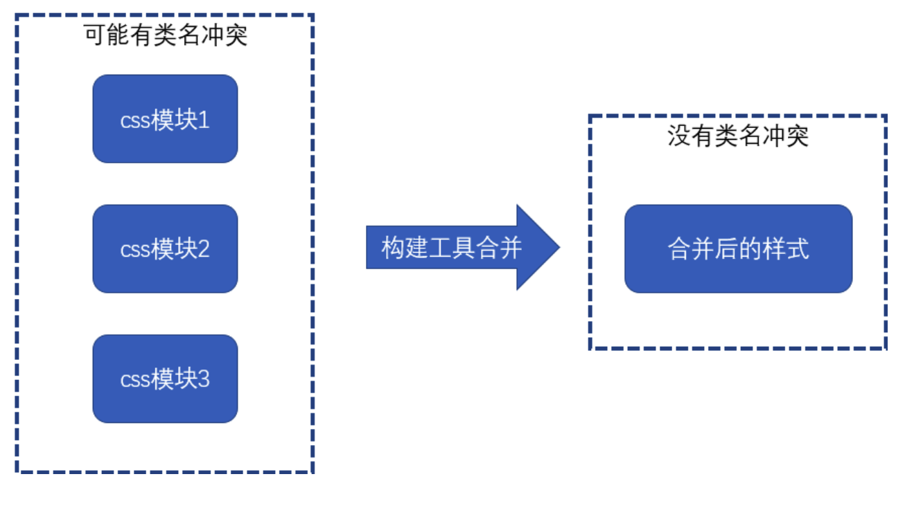
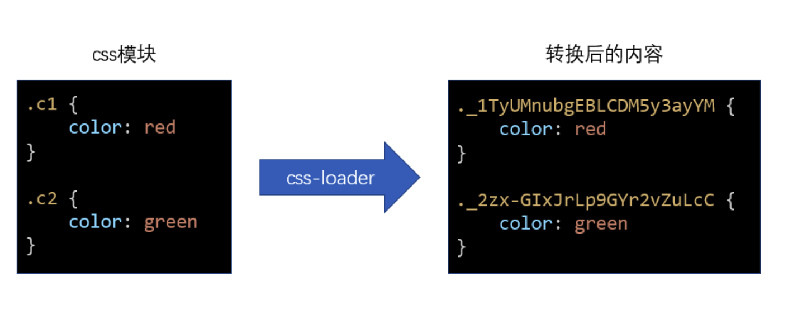
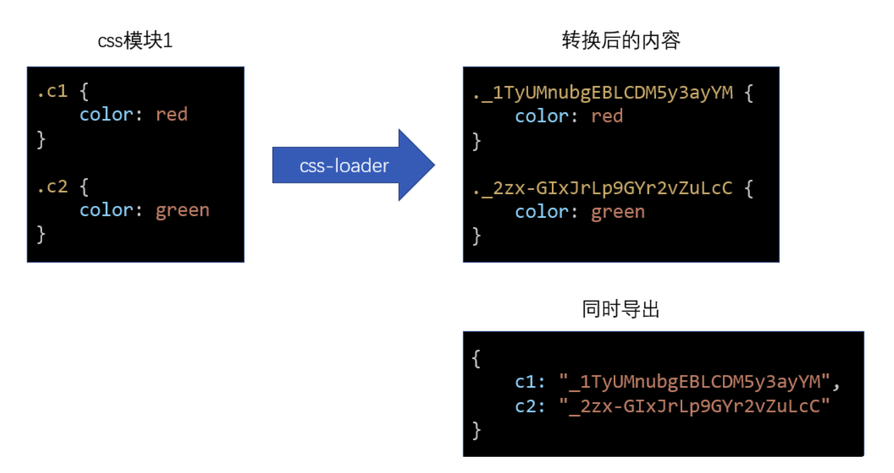
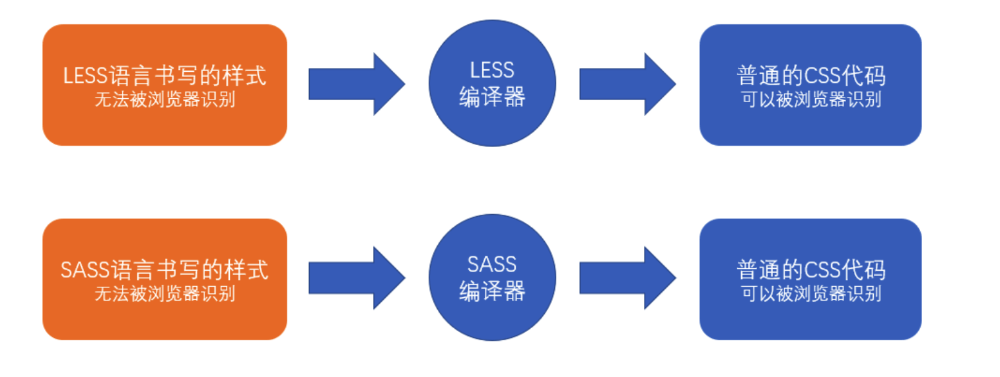

# CSS工程化

## css的问题

### 类名冲突的问题

当你写一个css类的时候，你是写全局的类呢，还是写多个层级选择后的类呢？

你会发现，怎么都不好

- 过深的层级不利于编写、阅读、压缩、复用
- 过浅的层级容易导致类名冲突

一旦样式多起来，这个问题就会变得越发严重，其实归根结底，就是类名冲突不好解决的问题

### 重复样式

这种问题就更普遍了，一些重复的样式值总是不断的出现在css代码中，维护起来极其困难

比如，一个网站的颜色一般就那么几种：

- primary
- info
- warn
- error
- success

如果有更多的颜色，都是从这些色调中自然变化得来，可以想象，这些颜色会到处充斥到诸如背景、文字、边框中，一旦要做颜色调整，是一个非常大的工程

### css文件细分问题

在大型项目中，css也需要更细的拆分，这样有利于css代码的维护。

比如，有一个做轮播图的模块，它不仅需要依赖js功能，还需要依赖css样式，既然依赖的js功能仅关心轮播图，那css样式也应该仅关心轮播图，由此类推，不同的功能依赖不同的css样式、公共样式可以单独抽离，这样就形成了不同于过去的css文件结构：文件更多、拆分的更细

而同时，在真实的运行环境下，我们却希望文件越少越好，这种情况和JS遇到的情况是一致的

因此，对于css，也需要工程化管理

从另一个角度来说，css的工程化会遇到更多的挑战，因为css不像JS，它的语法本身经过这么多年并没有发生多少的变化（css3也仅仅是多了一些属性而已），对于css语法本身的改变也是一个工程化的课题

## 如何解决

这么多年来，官方一直没有提出方案来解决上述问题

一些第三方机构针对不同的问题，提出了自己的解决方案

### 解决类名冲突

一些第三方机构提出了一些方案来解决该问题，常见的解决方案如下：

**命名约定**

即提供一种命名的标准，来解决冲突，常见的标准有：

- BEM
- OOCSS
- AMCSS
- SMACSS
- 其他

**css in js**

这种方案非常大胆，它觉得，css语言本身几乎无可救药了，干脆直接用js对象来表示样式，然后把样式直接应用到元素的style中

这样一来，css变成了一个一个的对象，就可以完全利用到js语言的优势，你可以：

- 通过一个函数返回一个样式对象
- 把公共的样式提取到公共模块中返回
- 应用js的各种特性操作对象，比如：混合、提取、拆分
- 更多的花样

> 这种方案在手机端的React Native中大行其道


**css module**

非常有趣和好用的css模块化方案，编写简单，绝对不重名

具体的课程中详细介绍

### 解决重复样式的问题

**css in js**

这种方案虽然可以利用js语言解决重复样式值的问题，但由于太过激进，很多习惯写css的开发者编写起来并不是很适应

**预编译器**

有些第三方搞出一套css语言的进化版来解决这个问题，它支持变量、函数等高级语法，然后经过编译器将其编译成为正常的css

这种方案特别像构建工具，不过它仅针对css

常见的预编译器支持的语言有：

- less
- sass

### 解决css文件细分问题

这一部分，就要依靠构建工具，例如webpack来解决了

利用一些loader或plugin来打包、合并、压缩css文件
## 利用webpack拆分css

要拆分css，就必须把css当成像js那样的模块；要把css当成模块，就必须有一个构建工具（webpack），它具备合并代码的能力

而webpack本身只能读取css文件的内容、将其当作JS代码进行分析，因此，会导致错误

于是，就必须有一个loader，能够将css代码转换为js代码

### css-loader

css-loader的作用，就是将css代码转换为js代码

它的处理原理极其简单：将css代码作为字符串导出

例如：

```css
.red{
    color:"#f40";
}
```

经过css-loader转换后变成js代码：

```javascript
module.exports = `.red{
    color:"#f40";
}`
```

> 上面的js代码是经过我简化后的，不代表真实的css-loader的转换后代码，css-loader转换后的代码会有些复杂，同时会导出更多的信息，但核心思想不变


再例如：

```css
.red{
    color:"#f40";
    background:url("./bg.png")
}
```

经过css-loader转换后变成js代码：

```javascript
var import1 = require("./bg.png");
module.exports = `.red{
    color:"#f40";
    background:url("${import1}")
}`;
```

这样一来，经过webpack的后续处理，会把依赖`./bg.png`添加到模块列表，然后再将代码转换为

```javascript
var import1 = __webpack_require__("./src/bg.png");
module.exports = `.red{
    color:"#f40";
    background:url("${import1}")
}`;
```

再例如：

```css
@import "./reset.css";
.red{
    color:"#f40";
    background:url("./bg.png")
}
```

会转换为：

```javascript
var import1 = require("./reset.css");
var import2 = require("./bg.png");
module.exports = `${import1}
.red{
    color:"#f40";
    background:url("${import2}")
}`;
```

总结，css-loader干了什么：

1. 将css文件的内容作为字符串导出
2. 将css中的其他依赖作为require导入，以便webpack分析依赖

### style-loader

由于css-loader仅提供了将css转换为字符串导出的能力，剩余的事情要交给其他loader或plugin来处理

style-loader可以将css-loader转换后的代码进一步处理，将css-loader导出的字符串加入到页面的style元素中

例如：

```css
.red{
    color:"#f40";
}
```

经过css-loader转换后变成js代码：

```javascript
module.exports = `.red{
    color:"#f40";
}`
```

经过style-loader转换后变成：

```javascript
module.exports = `.red{
    color:"#f40";
}`
var style = module.exports;
var styleElem = document.createElement("style");
styleElem.innerHTML = style;
document.head.appendChild(styleElem);
module.exports = {}
```

> 以上代码均为简化后的代码，并不代表真实的代码
style-loader有能力避免同一个样式的重复导入

配置：先用css-loader 在style-loader

```js
rules: [{
    test: /\.css$/, 
    use: ["style-loader", "css-loader"]
}]
```
## BEM

BEM是一套针对css类样式的命名方法。

> 其他命名方法还有：OOCSS、AMCSS、SMACSS等等


BEM全称是：**B**lock **E**lement **M**odifier

一个完整的BEM类名：block__element_modifier，例如：`banner__dot_selected`，可以表示：轮播图中，处于选中状态的小圆点

一切类名都采用顶级的，不分级
```css
banner__dot_selected{

}
banner_dot_unselected{

}
nav__dot_selected{

}
```

三个部分的具体含义为：

- **Block**：页面中的大区域，表示最顶级的划分，例如：轮播图(`banner`)、布局(`layout`)、文章(`article`)等等
- **element**：区域中的组成部分，例如：轮播图中的横幅图片(`banner__img`)、轮播图中的容器（`banner__container`）、布局中的头部(`layout__header`)、文章中的标题(`article_title`)
- **modifier**：可选。通常表示状态，例如：处于展开状态的布局左边栏（`layout__left_expand`）、处于选中状态的轮播图小圆点(`banner__dot_selected`)

在某些大型工程中，如果使用BEM命名法，还可能会增加一个前缀，来表示类名的用途，常见的前缀有：

- **l**: layout，表示这个样式是用于布局的
- **c**: component，表示这个样式是一个组件，即一个功能区域
- **u**: util，表示这个样式是一个通用的、工具性质的样式
- **j**: javascript，表示这个样式没有实际意义，是专门提供给js获取元素使用的

## css in js

css in js 的核心思想是：用一个JS对象来描述样式，而不是css样式表

例如下面的对象就是一个用于描述样式的对象：

```javascript
const styles = {
    backgroundColor: "#f40",
    color: "#fff",
    width: "400px",
    height: "500px",
    margin: "0 auto"
}
```

由于这种描述样式的方式**根本就不存在类名**，自然不会有类名冲突

至于如何把样式应用到界面上，不是它所关心的事情，你可以用任何技术、任何框架、任何方式将它应用到界面。

> 后续学习的vue、react都支持css in js，可以非常轻松的应用到界面


css in js的特点：

- **绝无冲突的可能**：由于它根本不存在类名，所以绝不可能出现类名冲突
- **更加灵活**：可以充分利用JS语言灵活的特点，用各种招式来处理样式
- **应用面更广**：只要支持js语言，就可以支持css in js，因此，在一些用JS语言开发移动端应用的时候非常好用，因为移动端应用很有可能并不支持css
- **书写不便**：书写样式，特别是公共样式的时候，处理起来不是很方便
- **在页面中增加了大量冗余内容**：在页面中处理css in js时，往往是将样式加入到元素的style属性中，会大量增加元素的内联样式，并且可能会有大量重复，不易阅读最终的页面代码

## css module

> 通过命名规范来限制类名太过死板，而css in js虽然足够灵活，但是书写不便。
css module 开辟一种全新的思路来解决类名冲突的问题


### 思路

css module 遵循以下思路解决类名冲突问题：

1. css的类名冲突往往发生在大型项目中
2. 大型项目往往会使用构建工具（webpack等）搭建工程
3. 构建工具允许将css样式切分为更加精细的模块
4. 同JS的变量一样，每个css模块文件中难以出现冲突的类名，冲突的类名往往发生在不同的css模块文件中
5. 只需要保证构建工具在合并样式代码后不会出现类名冲突即可



### 实现原理

在webpack中，作为处理css的css-loader，它实现了css module的思想，要启用css module，需要将css-loader的配置`modules`设置为`true`。
 
配置方法1:

```js
module.exports = {
    rules:[
        {
            test:/\.css$/,
            use: ['style-loader', 'css-loader']
        }
    ]
}
```

配置方法2:

```js
module.exports = {
    rules:[
        {
            test:/\.css$/,
            use: ['style-loader', {
                loader: 'css-loader',
                options: {
                    module: true
                }
            }]
        }
    ]
}
```

css-loader的实现方式如下：



原理极其简单，开启了css module后，css-loader会将样式中的类名进行转换，转换为一个唯一的hash值。

由于hash值是根据模块路径和类名生成的，因此，不同的css模块，哪怕具有相同的类名，转换后的hash值也不一样。


### 如何应用样式

css module带来了一个新的问题：源代码的类名和最终生成的类名是不一样的，而开发者只知道自己写的源代码中的类名，并不知道最终的类名是什么，那如何应用类名到元素上呢？

为了解决这个问题，css-loader会导出原类名和最终类名的对应关系，该关系是通过一个对象描述的



这样一来，我们就可以在js代码中获取到css模块导出的结果，从而应用类名了

style-loader为了我们更加方便的应用类名，会去除掉其他信息，仅暴露对应关系
```javascript
rules: [{
    // test: /\.css$/, use: ["style-loader", {
    //     loader: "css-loader",
    //     options: {
    //         // modules: {
    //         //     localIdentName: "[local]-[hash:5]"
    //         // }
    //         modules:true
    //     }
    // }]
    // 配置
    // 从右向左规则
    test: /\.css$/,
    use: ["style-loader", "css-loader?modules"]
}]
```

### 其他操作

### 全局类名

某些类名是全局的、静态的，不需要进行转换，仅需要在类名位置使用一个特殊的语法即可：

```css
:global(.main){
    ...
}
```

使用了global的类名不会进行转换，相反的，没有使用global的类名，表示默认使用了local

```css
:local(.main){
    ...
}
```

使用了local的类名表示局部类名，是可能会造成冲突的类名，会被css module进行转换

### 如何控制最终的类名

绝大部分情况下，我们都不需要控制最终的类名，因为控制它没有任何意义

如果一定要控制最终的类名，需要配置css-loader的`localIdentName`

### 其他注意事项

- css module往往配合构建工具使用
- css module仅处理顶级类名，尽量不要书写嵌套的类名，也没有这个必要
- css module仅处理类名，不处理其他选择器
- css module还会处理id选择器，不过任何时候都没有使用id选择器的理由
- 使用了css module后，只要能做到让类名望文知意即可，不需要遵守其他任何的命名规范

## CSS预编译器

### 基本原理

编写css时，受限于css语言本身，常常难以处理一些问题：

- 重复的样式值：例如常用颜色、常用尺寸
- 重复的代码段：例如绝对定位居中、清除浮动
- 重复的嵌套书写

由于官方迟迟不对css语言本身做出改进，一些第三方机构开始想办法来解决这些问题

其中一种方案，便是预编译器

预编译器的原理很简单，即使用一种更加优雅的方式来书写样式代码，通过一个编译器，将其转换为可被浏览器识别的传统css代码


目前，最流行的预编译器有**LESS**和**SASS**，由于它们两者特别相似，因此仅学习一种即可



> less官网：[http://lesscss.org/](http://lesscss.org/)
> 
> less中文文档1（非官方）：[http://lesscss.cn/](http://lesscss.cn/)
> 
> less中文文档2（非官方）：[https://less.bootcss.com/](https://less.bootcss.com/)
> 
> sass官网：[https://sass-lang.com/](https://sass-lang.com/)
> 
> sass中文文档1（非官方）：[https://www.sass.hk/](https://www.sass.hk/)
> 
> sass中文文档2（非官方）：[https://sass.bootcss.com/](https://sass.bootcss.com/)


### LESS的安装和使用

从原理可知，要使用LESS，必须要安装LESS编译器

LESS编译器是基于node开发的，可以通过npm下载安装

```shell
npm i -D less
```

安装好了less之后，它提供了一个CLI工具`lessc`，通过该工具即可完成编译

```shell
lessc less代码文件 编译后的文件
```

试一试:

新建一个`index.less`文件，编写内容如下：

```less
// less代码
@red: #f40;

.redcolor {
    color: @red;
}
```

在css文件夹终端中运行命令：

```shell
npx lessc index.less index.css
```

可以看到编译之后的代码：

```css
.redcolor {
  color: #f40;
}
```

### LESS的基本使用

具体的使用见文档：[https://less.bootcss.com/](https://less.bootcss.com/)

- 变量
- 混合
- 嵌套
- 运算
- 函数
- 作用域
- 注释
- 导入

### webpack中使用less
转换过程：
less --- 用less-loader ---> css ---用css loader ---> js -----用style-loader ---> 放到style元素
只需要进行配置webpack：less-loader
```javascript
rules: [{
            test: /\.css$/,
            use: ["style-loader", "css-loader"]
        },
        {
            test: /\.less$/,
            use: ["style-loader", "css-loader?modules", "less-loader"]
        },
    ]
```

## PostCss
### 什么是PostCss
 
学习到现在，可以看出，CSS工程化面临着诸多问题，而解决这些问题的方案多种多样。

如果把CSS单独拎出来看，光是样式本身，就有很多事情要处理。

既然有这么多事情要处理，何不把这些事情集中到一起统一处理呢？

PostCss就是基于这样的理念出现的。

PostCss类似于一个编译器，可以将样式源码编译成最终的CSS代码


看上去是不是和LESS、SASS一样呢？

但PostCss和LESS、SASS的思路不同，它其实只做一些代码分析之类的事情，将分析的结果交给插件，具体的代码转换操作是插件去完成的。


官方的一张图更能说明postcss的处理流程：


> 这一点有点像webpack，webpack本身仅做依赖分析、抽象语法树分析，其他的操作是靠插件和加载器完成的。

 
官网地址：[https://postcss.org/](https://postcss.org/)
github地址：[https://github.com/postcss/postcss](https://github.com/postcss/postcss)

### 安装

PostCss是基于node编写的，因此可以使用npm安装

```shell
npm i -D postcss
```

postcss库提供了对应的js api用于转换代码，如果你想使用postcss的一些高级功能，或者想开发postcss插件，就要api使用postcss，api的文档地址是：[http://api.postcss.org/](http://api.postcss.org/)

后缀：.postcss   .pcss     .sss
安装插件：postcss-sugarss-language可以识别拓展名

不过绝大部分时候，我们都是使用者，并不希望使用代码的方式来使用PostCss

因此，我们可以再安装一个postcss-cli，通过命令行来完成编译

```shell
npm i -D postcss-cli
```

postcss-cli提供一个命令，它调用postcss中的api来完成编译

命令的使用方式为：

```shell
postcss 源码文件 -o 输出文件
```

```javascript
rules: [{
    test: /\.pcss$/,
    use: ["style-loader", "css-loader?modules", "postcss-loader"]
}]
```
编译：npm start
### 配置文件

和webpack类似，postcss有自己的配置文件，该配置文件会影响postcss的某些编译行为。

配置文件的默认名称是：`postcss.config.js`

例如：

```javascript
module.exports = {
    map: false, //关闭source-map
}
```

### 插件

光使用postcss是没有多少意义的，要让它真正的发挥作用，需要插件

postcss的插件市场：[https://www.postcss.parts/](https://www.postcss.parts/)

下面罗列一些postcss的常用插件

### postcss-preset-env

过去使用postcss的时候，往往会使用大量的插件，它们各自解决一些问题

这样导致的结果是安装插件、配置插件都特别的繁琐

于是出现了这么一个插件`postcss-preset-env`，它称之为`postcss预设环境`，大意就是它整合了很多的常用插件到一起，并帮你完成了基本的配置，你只需要安装它一个插件，就相当于安装了很多插件了。

安装好该插件后，在postcss配置中加入下面的配置

```javascript
module.exports = {
    plugins: {
        "postcss-preset-env": {} // {} 中可以填写插件的配置
    }
}
```

该插件的功能很多，下面一一介绍

### 自动的厂商前缀

某些新的css样式需要在旧版本浏览器中使用厂商前缀方可实现

例如

```css
::placeholder {
    color: red;
}
```

该功能在不同的旧版本浏览器中需要书写为

```css
::-webkit-input-placeholder {
    color: red;
}
::-moz-placeholder {
    color: red;
}
:-ms-input-placeholder {
    color: red;
}
::-ms-input-placeholder {
    color: red;
}
::placeholder {
    color: red;
}
```

要完成这件事情，需要使用`autoprefixer`库。

而`postcss-preset-env`内部包含了该库，自动有了该功能。

如果需要调整**兼容的浏览器**范围，可以通过下面的方式进行配置

**方式1：在postcss-preset-env的配置中加入browsers**

```javascript
module.exports = {
    plugins: {
        "postcss-preset-env": {
            browsers: [
                "last 2 version",
                "> 1%"
            ]
        } 
    }
}
```

**方式2【推荐】：添加 .browserslistrc 文件  --通用**

创建文件`.browserslistrc`，填写配置内容

```
last 2 version
> 1%
```

**方式3【推荐】：在package.json的配置中加入browserslist**

```json
"browserslist": [
    "last 2 version",
    "> 1%"
]
```

`browserslist`是一个多行的（数组形式的）标准字符串。

它的书写规范多而繁琐，详情见：[https://github.com/browserslist/browserslist](https://github.com/browserslist/browserslist)

一般情况下，大部分网站都使用下面的格式进行书写

```
last 2 version
> 1% in CN
not ie <= 8
```

- `last 2 version`: 浏览器的兼容最近期的两个版本
- `> 1% in CN`: 匹配中国大于1%的人使用的浏览器， `in CN`可省略
- `not ie <= 8`: 排除掉版本号小于等于8的IE浏览器

> 默认情况下，匹配的结果求的是并集


你可以通过网站：[https://browserl.ist/](https://browserl.ist/) 对配置结果覆盖的浏览器进行查询，查询时，多行之间使用英文逗号分割

> browserlist的数据来自于[CanIUse](http://caniuse.com/)网站，由于数据并非实时的，所以不会特别准确


### 未来的CSS语法

CSS的某些前沿语法正在制定过程中，没有形成真正的标准，如果希望使用这部分语法，为了浏览器兼容性，需要进行编译

过去，完成该语法编译的是`cssnext`库，不过有了`postcss-preset-env`后，它自动包含了该功能。

你可以通过`postcss-preset-env`的`stage`配置，告知`postcss-preset-env`需要对哪个阶段的css语法进行兼容处理，它的默认值为2

```javascript
"postcss-preset-env": {
    stage: 0
}
```

一共有5个阶段可配置：

- Stage 0: Aspirational - 只是一个早期草案，极其不稳定
- Stage 1: Experimental - 仍然极其不稳定，但是提议已被W3C公认
- Stage 2: Allowable - 虽然还是不稳定，但已经可以使用了
- Stage 3: Embraced - 比较稳定，可能将来会发生一些小的变化，它即将成为最终的标准
- Stage 4: Standardized - 所有主流浏览器都应该支持的W3C标准

了解了以上知识后，接下来了解一下未来的css语法，尽管某些语法仍处于非常早期的阶段，但是有该插件存在，编译后仍然可以被浏览器识别

#### 变量

未来的css语法是天然支持变量的

在`:root{}`中定义常用变量，使用`--`前缀命名变量

```css
:root{
    --lightColor: #ddd;
    --darkColor: #333;
}

a{			
    color: var(--lightColor);
    background: var(--darkColor);
}
```

> 编译后，仍然可以看到原语法，因为某些新语法的存在并不会影响浏览器的渲染，尽管浏览器可能不认识
如果不希望在结果中看到新语法，可以配置`postcss-preset-env`的`preserve`为`false`


#### 自定义选择器

```css
@custom-selector :--heading h1, h2, h3, h4, h5, h6;
@custom-selector :--enter :focus,:hover;

a:--enter{
    color: #f40;
}

:--heading{
    font-weight:bold;
}

:--heading.active{
    font-weight:bold;
}
```

编译后

```css
a:focus,a:hover{
    color: #f40;
}

h1,h2,h3,h4,h5,h6{
    font-weight:bold;
}

h1.active,h2.active,h3.active,h4.active,h5.active,h6.active{
    font-weight:bold;
}
```

#### 嵌套

与LESS相同，只不过嵌套的选择器前必须使用符号`&`

```less
.a {
    color: red;
    & .b {
        color: green;
    }

    & > .b {
        color: blue;
    }

    &:hover {
        color: #000;
    }
}
```

编译后

```css
.a {
    color: red
}

.a .b {
    color: green;
}

.a>.b {
    color: blue;
}

.a:hover {
    color: #000;
}
```

### postcss-apply

该插件可以支持在css中书写属性集

类似于LESS中的混入，可以利用CSS的新语法定义一个CSS代码片段，然后在需要的时候应用它

```less
:root {
  --center: {
    position: absolute;
    left: 50%;
    top: 50%;
    transform: translate(-50%, -50%);
  };
}

.item{
    @apply --center;
}
```

编译后

```css
.item{
  position: absolute;
  left: 50%;
  top: 50%;
  -webkit-transform: translate(-50%, -50%);
  transform: translate(-50%, -50%);
}
```

> 实际上，该功能也属于cssnext，不知为何`postcss-preset-env`没有支持


### postcss-color-function

该插件支持在源码中使用一些颜色函数

```less
body {
    /* 使用颜色#aabbcc，不做任何处理，等同于直接书写 #aabbcc */
    color: color(#aabbcc);
    /* 将颜色#aabbcc透明度设置为90% */
    color: color(#aabbcc a(90%));
    /* 将颜色#aabbcc的红色部分设置为90% */
    color: color(#aabbcc red(90%));
    /* 将颜色#aabbcc调亮50%（更加趋近于白色），类似于less中的lighten函数 */
    color: color(#aabbcc tint(50%));
    /* 将颜色#aabbcc调暗50%（更加趋近于黑色），类似于less中的darken函数 */
    color: color(#aabbcc shade(50%));
}
```

编译后

```css
body {
    /* 使用颜色#aabbcc，不做任何处理，等同于直接书写 #aabbcc */
    color: rgb(170, 187, 204);
    /* 将颜色#aabbcc透明度设置为90% */
    color: rgba(170, 187, 204, 0.9);
    /* 将颜色#aabbcc的红色部分设置为90% */
    color: rgb(230, 187, 204);
    /* 将颜色#aabbcc调亮50%（更加趋近于白色），类似于less中的lighten函数 */
    color: rgb(213, 221, 230);
    /* 将颜色#aabbcc调暗50%（更加趋近于黑色），类似于less中的darken函数 */
    color: rgb(85, 94, 102);
}
```

### postcss-import

该插件可以让你在`postcss`文件中导入其他样式代码，通过该插件可以将它们合并

> 由于后续的知识点中，会将postcss加入到webpack中，而webpack本身具有依赖分析的功能，所以该插件的实际意义不大


## stylelint

> 官网：[https://stylelint.io/](https://stylelint.io/)


在实际的开发中，我们可能会错误的或不规范的书写一些css代码，stylelint插件会即时的发现错误

由于不同的公司可能使用不同的CSS书写规范，stylelint为了保持灵活，它本身并没有提供具体的规则验证

你需要安装或自行编写规则验证方案

通常，我们会安装`stylelint-config-standard`库来提供标准的CSS规则判定

安装好后，我们需要告诉stylelint使用该库来进行规则验证

告知的方式有多种，比较常见的是使用文件`.stylelintrc`

```json
//.styleintrc
{
  "extends": "stylelint-config-standard"
}
```

此时，如果你的代码出现不规范的地方，编译时将会报出错误

```css
body {
    background: #f4;
}
```


发生了两处错误：

1. 缩进应该只有两个空格
2. 十六进制的颜色值不正确

如果某些规则并非你所期望的，可以在配置中进行设置

```json
{
    "extends": "stylelint-config-standard",
    "rules": {
        "indentation": null
    }
}
```

设置为`null`可以禁用该规则，或者设置为4，表示一个缩进有4个空格。具体的设置需要参见stylelint文档：[https://stylelint.io/](https://stylelint.io/)

但是这种错误报告需要在编译时才会发生，如果我希望在编写代码时就自动在编辑器里报错呢？

既然想在编辑器里达到该功能，那么就要在编辑器里做文章

安装vscode的插件`stylelint`即可，它会读取你工程中的配置文件，按照配置进行实时报错

> 实际上，如果你拥有了`stylelint`插件，可以不需要在postcss中使用该插件了


## 抽离css文件

目前，css代码被css-loader转换后，交给的是style-loader进行处理。

style-loader使用的方式是用一段js代码，将样式加入到style元素中。

而实际的开发中，我们往往希望依赖的样式最终形成一个css文件

此时，就需要用到一个库：`mini-css-extract-plugin`

该库提供了1个plugin和1个loader

- plugin：负责生成css文件
- loader：负责记录要生成的css文件的内容，同时导出开启css-module后的样式对象

使用方式：

```javascript
const MiniCssExtractPlugin = require("mini-css-extract-plugin")
module.exports = {
    module: {
        rules: [
            {
                test: /\.css$/, use: [MiniCssExtractPlugin.loader, "css-loader?modules"]
            }
        ]
    },
    plugins: [
        new MiniCssExtractPlugin() //负责生成css文件
    ]
}
```

**配置生成的文件名**

同`output.filename`的含义一样，即根据chunk生成的样式文件名

配置生成的文件名，例如`[name].[contenthash:5].css`

默认情况下，每个chunk对应一个css文件
