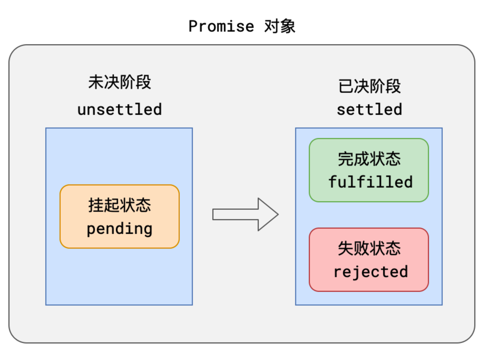
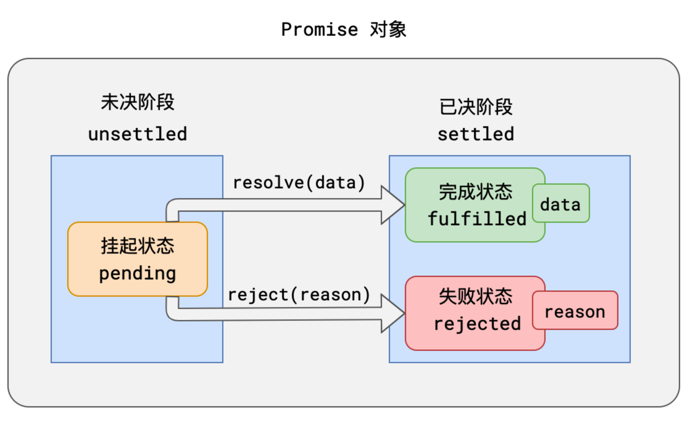
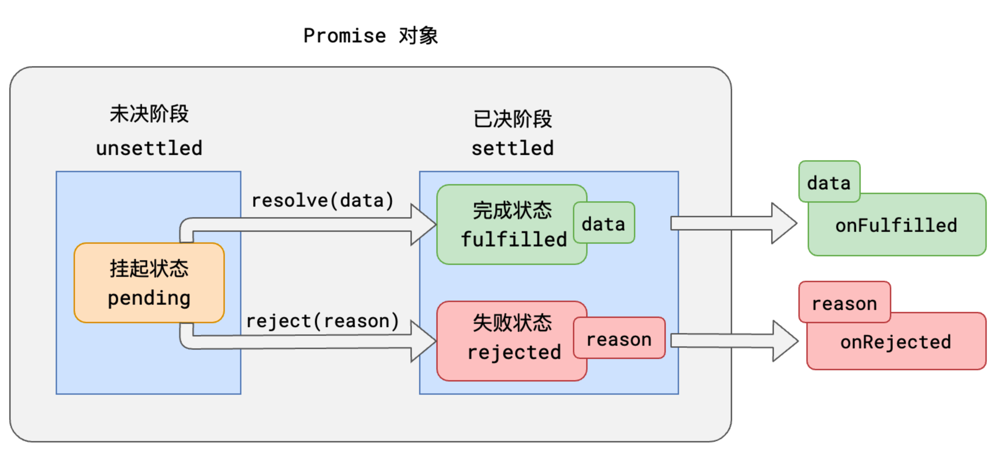
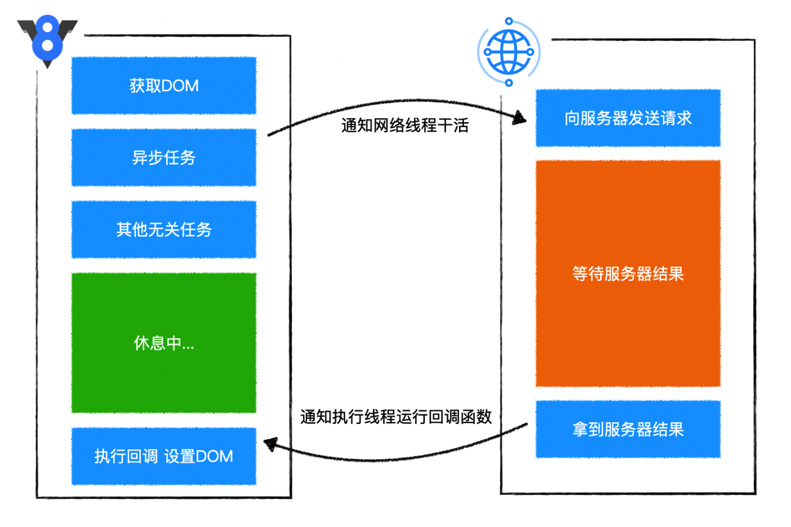

# 异步处理

[[toc]]

## 事件循环 eventLoop
JS 运行的环境称之为宿主环境。JS语言不只运行在浏览器

执行栈：call stack(一个数据结构)，用于存放各种函数的执行环境，每一个函数执行之前，它的相关信息会加入到执行栈。函数调用之前，创建执行环境，然后加入到执行栈；函数调用之后，销毁执行环境。
JS 引擎永远执行的是执行栈的最顶部。

异步函数：某些函数不会立即执行，需要等到某个时机到达后才会执行，这样的函数称之为异步函数。比如事件处理函数。异步函数的执行时机，会被宿主环境控制。
浏览器宿主环境中包含 5 个线程：

- JS 引擎：负责执行执行栈的最顶部代码
- GUI 线程：负责渲染页面
- 事件监听线程：负责监听各种事件
- 计时线程：负责计时
- 网络线程：负责网络通信

当上面的线程发生了某些事请，如果该线程发现，这件事情有处理程序，它会将该处理程序加入一个叫做事件队列的内存。当 JS 引擎发现，执行栈中已经没有了任何内容后，会将事件队列中的第一个函数加入到执行栈中执行。
JS 引擎对事件队列的取出执行方式，以及与宿主环境的配合，称之为事件循环。

[JavaScript 运行机制详解：再谈Event Loop](https://www.ruanyifeng.com/blog/2014/10/event-loop.html)

事件队列在不同的宿主环境中有所差异，大部分宿主环境会将事件队列进行细分。在浏览器中，事件队列分为两种：

- 宏任务（队列）：macroTask，计时器结束的回调、事件回调、http 回调等等绝大部分异步函数进入宏队列
- 微任务（队列）：MutationObserver，Promise 产生的回调进入微队列——vip

> MutationObserver 用于监听某个 DOM 对象的变化
> 当执行栈清空时，JS 引擎首先会将微任务中的所有任务依次执行结束，如果没有微任务，则执行宏任务。


看下面一串代码

```html
<script>
  let count = 1;
  const ul = document.getElementById("container");
  document.getElementById("btn").onclick = function A() {
    var li = document.createElement("li")
    li.innerText = count++;
    ul.appendChild(li);
    console.log("添加了一个li")
  }

  //监听ul
  const observer = new MutationObserver(function B() {
    //当监听的dom元素发生变化时运行的回调函数
    console.log("ul元素发生了变化")
  })
  //监听ul
  observer.observe(ul, {  
    attributes: true, //监听属性的变化
    childList: true, //监听子元素的变化
    subtree: true //监听子树的变化
  })
</script>
```

为什么先执行宏队列了？

> 点击按钮的时候还没有往ul里面加li，所以微队列也不执行

宏队列演示

```html
<ul id="container">

</ul>

<button id="btn">点击</button>
<script>
  let count = 1;
  const ul = document.getElementById("container");
  document.getElementById("btn").onclick = function A() {
      setTimeout(function C() {
          console.log("添加了一个li")
      }, 0); 
      var li = document.createElement("li")
      li.innerText = count++;
      ul.appendChild(li);
  }

  //监听ul
  const observer = new MutationObserver(function B() {
      //当监听的dom元素发生变化时运行的回调函数
      console.log("ul元素发生了变化")
  })
  //监听ul
  observer.observe(ul, {	
      attributes: true, //监听属性的变化
      childList: true, //监听子元素的变化
      subtree: true //监听子树的变化
  })
  //取消监听
  // observer.disconnect();
</script>
```

## 事件和回调函数缺陷

我们习惯于使用传统的回调或事件处理来解决异步问题
事件：某个对象的属性是一个函数，当发生某一件事时，运行该函数

```javascript
dom.onclick = function () {};
```

回调：运行某个函数以实现某个功能的时候，传入一个函数作为参数，当发生某件事的时候，会运行该函数。

```javascript
dom.addEventListener("click", function () {});
```
本质上，事件和回调并没有本质的区别，只是把函数放置的位置不同而已。一直以来，该模式都运作良好。直到前端工程越来越复杂...
目前，该模式主要面临以下两个问题：

1. 回调地狱：某个异步操作需要等待之前的异步操作完成，无论用回调还是事件，都会陷入不断的嵌套
2. 异步之间的联系：某个异步操作要等待多个异步操作的结果，对这种联系的处理，会让代码的复杂度剧增


```html
<p>
    <button id="btn1">按钮1：给按钮2注册点击事件</button>
    <button id="btn2">按钮2：给按钮3注册点击事件</button>
    <button id="btn3">按钮3：点击后弹出hello</button>
</p>
<script>
    const btn1 = document.getElementById("btn1"),
          btn2 = document.getElementById("btn2"),
          btn3 = document.getElementById("btn3");
    btn1.addEventListener("click", function() {
        //按钮1的其他事情
        btn2.addEventListener("click", function() {
            //按钮2的其他事情
            btn3.addEventListener("click", function() {
                alert("hello");
            })
        })
    })
</script>
```

## 异步处理的通用模型

ES 官方参考了大量的异步场景，总结出了一套异步的通用模型，该模型可以覆盖几乎所有的异步场景，甚至是同步场景。
值得注意的是，为了兼容旧系统，ES6 并不打算抛弃掉过去的做法，只是基于该模型推出一个全新的 API，使用该 API，会让异步处理更加的简洁优雅。
理解该 API，最重要的，是理解它的异步模型

1. ES6 将某一件可能发生异步操作的事情，分为两个阶段：**unsettled** 和 **settled**


- unsettled： 未决阶段，表示事情还在进行前期的处理，并没有发生通向结果的那件事
- settled：已决阶段，事情已经有了一个结果，不管这个结果是好是坏，整件事情无法逆转

事情总是从 未决阶段 逐步发展到 已决阶段的。并且，未决阶段拥有控制何时通向已决阶段的能力。

2. ES6 将事情划分为三种状态： pending、resolved、rejected
- pending: 挂起，处于未决阶段，则表示这件事情还在挂起（最终的结果还没出来）
- resolved：已处理，已决阶段的一种状态，表示整件事情已经出现结果，并是一个可以按照正常逻辑进行下去的结果
- rejected：已拒绝，已决阶段的一种状态，表示整件事情已经出现结果，并是一个无法按照正常逻辑进行下去的结果，通常用于表示有一个错误

既然未决阶段有权力决定事情的走向，因此，未决阶段可以决定事情最终的状态！

我们将 把事情变为 resolved 状态的过程叫做：**resolve**，推向该状态时，可能会传递一些数据

我们将 把事情变为 rejected 状态的过程叫做：**reject**，推向该状态时，同样可能会传递一些数据，通常为错误信息

**始终记住，无论是阶段，还是状态，是不可逆的！**

3. 当事情达到已决阶段后，通常需要进行后续处理，不同的已决状态，决定了不同的后续处理。

- resolved 状态：这是一个正常的已决状态，后续处理表示为 thenable
- rejected 状态：这是一个非正常的已决状态，后续处理表示为 catchable

后续处理可能有多个，因此会形成作业队列，这些后续处理会按照顺序，当状态到达后依次执行

4. 整件事称之为 Promise


**理解上面的概念，对学习 Promise 至关重要！**

### Promise A+

Promise是一套专门处理异步场景的规范，它能有效的避免回调地狱的产生，使异步代码更加清晰、简洁、统一

这套规范最早诞生于前端社区，规范名称为[Promise A+](https://promisesaplus.com/)

该规范出现后，立即得到了很多开发者的响应

Promise A+ 规定：

1.  所有的异步场景，都可以看作是一个异步任务，每个异步任务，在JS中应该表现为一个**对象**，该对象称之为**Promise对象**，也叫做任务对象 

2.  每个任务对象，都应该有两个阶段、三个状态 


根据常理，它们之间存在以下逻辑： 
   - 任务总是从未决阶段变到已决阶段，无法逆行
   - 任务总是从挂起状态变到完成或失败状态，无法逆行
   - 时间不能倒流，历史不可改写，任务一旦完成或失败，状态就固定下来，永远无法改变
3.  `挂起->完成`，称之为`resolve`；`挂起->失败`称之为`reject`。任务完成时，可能有一个相关数据；任务失败时，可能有一个失败原因。



4.  可以针对任务进行后续处理，针对完成状态的后续处理称之为onFulfilled，针对失败的后续处理称之为onRejected



ES6提供了一套API，实现了Promise A+规范

## Promise的基本使用

```javascript
const pro = new Promise((resolve, reject)=>{
    // 未决阶段的处理
    // 通过调用resolve函数将Promise推向已决阶段的resolved状态
    // 通过调用reject函数将Promise推向已决阶段的rejected状态
    // resolve和reject均可以传递最多一个参数，表示推向状态的数据
  // 立即执行
})

pro.then(data=>{
    //这是thenable函数，如果当前的Promise已经是resolved状态，该函数会立即执行
    //如果当前是未决阶段，则会加入到作业队列，等待到达resolved状态后执行
    //data为状态数据
}, err=>{
    //这是catchable函数，如果当前的Promise已经是rejected状态，该函数会立即执行
    //如果当前是未决阶段，则会加入到作业队列，等待到达rejected状态后执行
    //err为状态数据
})
```

**细节**

- 未决阶段的处理函数是同步的，会立即执行
- thenable和catchable函数是异步的，就算是立即执行，也会加入到事件队列中等待执行，并且，加入的队列是微队列
- pro.then可以只添加thenable函数，pro.catch可以单独添加catchable函数
- 在未决阶段的处理函数中，如果发生未捕获的错误，会将状态推向rejected，并会被catchable捕获
- 一旦状态推向了已决阶段，无法再对状态做任何更改
- **Promise并没有消除回调，只是让回调变得可控**

创建 Promise

```javascript
const pro = new Promise((resolve, reject) => {
  setTimeout(() => {
    if (Math.random() < 0.1) {
      resolve(true);
    } else {
      resolve(false);
    }
  }, 3000);
})
```

封装Ajax
```javascript

// 辅助函数,把传进来的对象拼接成url的字符串
function toData(obj) {
  if (obj === null) {
    return obj;
  }
  let arr = [];
  for (let i in obj) {
    let str = i + "=" + obj[i];
    arr.push(str);
  }
  return arr.join("&");
}
// 封装Ajax
function ajax(obj) {
  return new Promise((resolve, reject) => {
    //指定提交方式的默认值
    obj.type = obj.type || "get";
    //设置是否异步，默认为true(异步)
    obj.async = obj.async || true;
    //设置数据的默认值
    obj.data = obj.data || null;
    // 根据不同的浏览器创建XHR对象
    let xhr = null;
    if (window.XMLHttpRequest) {
      // 非IE浏览器
      xhr = new XMLHttpRequest();
    } else {
      // IE浏览器
      xhr = new ActiveXObject("Microsoft.XMLHTTP");
    }
    // 区分get和post,发送HTTP请求
    if (obj.type === "post") {
      xhr.open(obj.type, obj.url, obj.async);
      xhr.setRequestHeader("Content-Type", "application/x-www-form-urlencoded");
      let data = toData(obj.data);
      xhr.send(data);
    } else {
      let url = obj.url + "?" + toData(obj.data);
      xhr.open(obj.type, url, obj.async);
      xhr.send();
    }
    // 接收返回过来的数据
    xhr.onreadystatechange = function () {
      if (xhr.readyState === 4) {
        if (xhr.status >= 200 && xhr.status < 300 || xhr.status == 304) {
          resolve(JSON.parse(xhr.responseText))
        } else {
          reject(xhr.status)
        }
      }
    }
  })
}

const pro = Promise((resolve, reject) => {
  ajax({
    url: "./data/students.json?name=李华",
    // success: function(data) {
    // }
    // 速写
    success(data) {
      resolve(data);
    },
    error(err) {
      reject(error);
    }
  })
})
```
如果当前的Promise已经是resolved状态，该函数会立即执行
```javascript
const pro = new Promise((resolve, reject) => {
    console.log('未决阶段')
    resolve(123);
})
pro.then(data => {
    //pro的状态是resloved
    console.log(data);// 123
})
```
如果当前是未决阶段，则会加入到作业队列，等待到达resolved状态后执行
```javascript
const pro = new Promise((resolve, reject) => {
    console.log('未决阶段')
    setTimeout(() => {
        resolve(123);
    }, 3000)
})
pro.then(data => {
    //pro的状态是pending
    console.log(data);
})
// 可以注册多个then用来表示已决做什么
```
catchable
```javascript
const pro = new Promise((resolve, reject) => {
    console.log('未决阶段')
    setTimeout(() => {
        if (Math.random() < 0.5) {
            resolve(123)
        } else {
            reject(new Error('sanjs'));
        }
    }, 3000)
})
pro.then(data => {
    console.log(data);
}, err => {
    console.log(err);
})
```

封装初级演示1
```javascript
function biaobai(god) {
    return new Promise((resolve, reject) => {
        console.log(`向${god}发出了请求`);
        setTimeout(() => {
            if (Math.random() < 0.1) {
                resolve(true)// 一定resolve成功
            } else {
                //resolve
                resolve(false);//  一定resolve成功
            }
        }, 3000);
    })
}
//一定成功，失败指的是短信发不出去
const pro = biaobai("女神1").then(result => {
    console.log(result);
})
```


演示2

```html
<script>
    // const pro = new Promise((resolve, reject) => {
    //     console.log("未决阶段")
    //     resolve(123);
    // })
    // pro.then(data => {
    //     // pro的状态是resolved
    //     console.log(data);
    // })

    const pro = new Promise((resolve, reject) => {
        console.log("未决阶段")
        setTimeout(() => {
            resolve(123);
        }, 3000);
    })
    pro.then(data => {
        // pro的状态是pending
        console.log(data);
    })
    pro.then(data => {
        // pro的状态是pending
        console.log(data);
    })
    pro.then(data => {
        // pro的状态是pending
        console.log(data);
    })
</script>
```

演示4

```html
<script>
    const pro = new Promise((resolve, reject) => {
        console.log("未决阶段")
        setTimeout(() => {
            if (Math.random < 0.5) {
                resolve(123)
            } else {
                reject(new Error("asdfasdf"));
            }
        }, 3000);
    })
    pro.then(data => {
        console.log(data);
    }, err => {
        console.log(err)
    })
</script>
```

演示5

```html
<script>
    const pro = new Promise((resolve, reject) => {
        console.log("a")
        resolve(1);
        setTimeout(() => {
            console.log("b")
        }, 0);
    })
    //pro: resolved
    pro.then(data => {
        console.log(data)
    })
    pro.catch(err => {
        console.log(err)
    })
    console.log("c")
</script>
```

在未决阶段的处理函数中，如果发生未捕获的错误，会将状态推向rejected，并会被catchable捕获

```html
<script>
    const pro = new Promise((resolve, reject) => {
        throw new Error("123"); // 导致pro变成rejected
    })
    pro.then(data => {
        console.log(data)
    })
    pro.catch(err => {
        console.log(err)
    })
</script>
```

一旦状态推向了已决阶段，无法再对状态做任何更改。（未捕获的错误）

如果已经捕获了错误
```javascript
const pro = new Promise((resolve, reject) => {
    try {
        throw new Error("abc");
    } catch {
    }
    resolve(1); //错误被捕获，有效了
    reject(2); //无效
    resolve(3); //无效
    reject(4); //无效
})
pro.then(data => {
    console.log(data)
})
pro.catch(err => {
    console.log(err)
}
```
未决阶段的处理函数是同步的，会立即执行thenable和catchable函数是异步的，就算是立即执行，也会加入到事件队列中等待执行，并且，加入的队列是微队列

注意：thenable和catchable函数是异步的，就算是立即执行，也会加入到事件队列中等待执行，并且，加入的队列是**微队列**

## Promise的串联

当后续的Promise需要用到之前的Promise的处理结果时，需要Promise的串联
Promise对象中，无论是then方法还是catch方法，它们都具有返回值，返回的是一个全新的Promise对象，它的状态满足下面的规则：

1. 如果当前的Promise是未决的，得到的新的Promise是挂起状态
2. 如果当前的Promise是已决的，会运行响应的后续处理函数，并将后续处理函数的结果（返回值）作为resolved状态数据，应用到新的Promise中；如果后续处理函数发生错误，则把返回值作为rejected状态数据，应用到新的Promise中。
```javascript
const pro = ajax({
  url: "./data/students.json"
})
const pro2 = pro.then(resp => {// 这里面要运行完pro2才已决
  // throw new Error('错误')// reject
  for (let i = 0; i < resp.length; i++) {
    if (resp[i].name === "李华") {
      const cid = resp[i].classId;
    }
  }
})
console.log(pro2)
```
面试题：**后续的Promise一定会等到前面的Promise有了后续处理结果后，才会变成已决状态**
```javascript
const pro1 = new Promise((resolve, reject) => {
  resolve(1);
})
console.log(pro1);//fulfilled
const pro2 = pro1.then(result => result * 2);
// pro2是一个Promise对象
console.log(pro2)//pending
// 因为then是异步的，运行到打印pro2的时候函数还没调用(同步代码)
```
面试题
```javascript
const pro1 = new Promise((resolve, reject) => {
  resolve(1);
})
const pro2 = pro1.then(result => result * 2);//这里变成状态数据:2，pro2变成了已决
pro2.then(result => console.log(result), err => console.log(err))
```
**面试题**
```javascript
const pro1 = new Promise((resolve, reject) => {
  throw 1;// 推向rejected,导致pro2的err运行
})
const pro2 = pro1.then(result => {
  return result * 2;
}, err => err * 3);// 3, 此时pro2已决了
pro2.then(result => console.log(result * 2), err => console.log(err * 3))//这里主要看上述处理有没有错误，pro2没有错误，执行result
结果：6
```
变式
```javascript
const pro1 = new Promise((resolve, reject) => {
  throw 1;
})
const pro2 = pro1.then(result => {
  return result * 2;
}, err => {
  throw err;
});
pro2.then(result => console.log(result * 2), err => console.log(err * 3))//3
```
思考：then函数返回的Promise对象一开始一定是挂起状态：因为then的后序处理是异步的
```javascript
const pro1 = new Promise((resolve, reject) => {
  throw 1;
})
const pro2 = pro1.then(result => {// 这里是第一个调用then的，只看这里的处理函数
  return result * 2;
}, err => {
  return err * 3;//3
});
const pro3 = pro1.catch(err => {// 这里得到的是一个新的Promise
  throw err * 2;//1*2
})
pro2.then(result => console.log(result * 2), err => console.log(err * 3)) // 输出6，调用的是result
pro3.then(result => console.log(result * 2), err => console.log(err * 3)) // 输出6，调用的是err
```
如果前面的Promise的后续处理，返回的是一个Promise，则返回的新的Promise状态和后续处理返回的Promise状态保持一致。
```javascript
const pro1 = new Promise((resolve, reject) => {
  resolve(1);
})
const pro2 = new Promise((resolve, reject) => {
  resolve(2)
})
const pro3 = pro1.then(result => {
  return pro2;
}).then(result => {
  console.log(result)// 2
})
```
变式
```javascript
const pro1 = new Promise((resolve, reject) => {
  resolve(1);
})
const pro2 = new Promise((resolve, reject) => {
  setTimeout(() => {
    resolve(2)
  }, 3000)
})
const pro3 = pro1.then(result => {
  console.log("结果出来了，得到的是一个Promise")//一开始Pro1已决了，所以这个一开始就执行
  return pro2;// Pro3要跟pro2状态保持一致，pro2还没运行出来，pro3得等着
}).then(result => {
  console.log(result)// 2；所以这里要等3s后才输出
})
```
简化为链式编程：便于阅读
```javascript
pro1.then(result => {
  console.log("结果出来了，得到的是一个Promise")
  return pro2;
}).then(result => {
  console.log(result)// 这只是打印结果，对后续有影响的是函数的返回值
  // 不写，默认return undefined
}).then(result => {
  console.log(result)// undefined
})
```
解决实战问题
```javascript
//获取李华所在班级的老师的信息
//1. 获取李华的班级id   Promise
//2. 根据班级id获取李华所在班级的老师id   Promise
//3. 根据老师的id查询老师信息   Promise
const pro = ajax({
  url: "./data/students.json"
})
pro.then(resp => {
  for (let i = 0; i < resp.length; i++) {
    if (resp[i].name === "李华") {
      return resp[i].classId; //班级id
    }
  }
}).then(cid => {
  return ajax({
    url: "./data/classes.json?cid=" + cid
  }).then(cls => {
    for (let i = 0; i < cls.length; i++) {
      if (cls[i].id === cid) {
        return cls[i].teacherId;
      }
    }
  })
}).then(tid => {
  return ajax({
    url: "./data/teachers.json"
  }).then(ts => {
    for (let i = 0; i < ts.length; i++) {
      if (ts[i].id === tid) {
        return ts[i];
      }
    }
  })
}).then(teacher => {
  console.log(teacher);
})
```
实战案例
```javascript
function biaobai(god) {
  return new Promise(resolve => {
    console.log(`向${god}发出了请求`);
    setTimeout(() => {
      if (Math.random() < 0.3) {
        resolve(true)
      } else {
        resolve(false);
      }
    }, 500);
  })
}
biaobai("女神1").then(resp => {
  if (resp) {
    console.log("女神1同意了")
    return;
  } else {
    return biaobai("女神2");
  }
}).then(resp => {
  if (resp === undefined) {
    return;
  } else if (resp) {
    console.log("女神2同意了")
    return;
  } else {
    return biaobai("女神3");
  }
}).then(resp => {
  if (resp === undefined) {
    return;
  } else if (resp) {
    console.log("女神3同意了")
  } else {
    console.log("都被拒绝了！");
  }
})
// 切记：上一个处理的结果就是下一个处理的状态数据
```
优化：增加了初始化
```javascript
const gods = ["女神1", "女神2", "女神3", "女神4", "女神5"];
let pro;
for (let i = 0; i < gods.length; i++) {
  if (i === 0) {
    pro = biaobai(gods[i]);
  }
  pro = pro.then(resp => {
    if (resp === undefined) {
      return;
    } else if (resp) {
      console.log(`${gods[i]}同意了`)
      return;
    } else {
      console.log(`${gods[i]}拒绝了`)
      if (i < gods.length - 1) {
        return biaobai(gods[i + 1]);
      }
    }
  })
}
```
## Promise的其他API
### 原型成员 (实例成员)

- then：注册一个后续处理函数，当Promise为resolved状态时运行该函数
- catch：注册一个后续处理函数，当Promise为rejected状态时运行该函数
- finally：[ES2018]注册一个后续处理函数（无参），当Promise为已决时运行该函数
> 一个Promise不可能then，catch都执行

```javascript
const pro = new Promise((resolve, reject) => {
  reject(1);
})
pro.finally(() => console.log("finally1"))
pro.finally(() => console.log("finally2"))
pro.then(resp => console.log("then1", resp * 1));
pro.then(resp => console.log("then2", resp * 2));
pro.catch(resp => console.log("catch1", resp * 1));
pro.catch(resp => console.log("catch2", resp * 2));
```
### 构造函数成员 （静态成员）

- resolve(数据)：该方法返回一个resolved状态的Promise，传递的数据作为状态数据
```javascript
const pro = new Promise((resolve, reject) => {
  resolve(1);
})
// 等效于：
const pro = Promise.resolve(1);
```
特殊情况：如果传递的数据是Promise，则直接返回传递的Promise对象
```javascript
const p = new Promise((resolve, reject) => {
  resolve(3);
})
// const pro = Promise.resolve(p);
//等效于
const pro = p;
console.log(pro === p)//true
```

- reject(数据)：该方法返回一个rejected状态的Promise，传递的数据作为状态数据
```javascript
const pro = new Promise((resolve, reject) => {
  reject(1);
})
// 等效于：
const pro = Promise.reject(1);
```

- all(iterable)：这个方法返回一个新的promise对象，该promise对象在iterable参数对象里所有的promise对象**都成功的时候才会触发成功**，一旦有任何一个iterable里面的promise对象失败则立即触发该promise对象的失败。这个新的promise对象在触发成功状态以后，会把一个包含iterable里所有promise返回值的数组作为成功回调的返回值，顺序跟iterable的顺序保持一致；如果这个新的promise对象触发了失败状态，它会把iterable里第一个触发失败的promise对象的错误信息作为它的失败错误信息。Promise.all方法常被用于处理多个promise对象的状态集合。
```javascript
function getRandom(min, max) {
  return Math.floor(Math.random() * (max - min)) + min;
}
const proms = [];
for (let i = 0; i < 10; i++) {
  proms.push(new Promise((resolve, reject) => {
    setTimeout(() => {
      if (Math.random() < 0.5) {
        console.log(i, "完成");
        resolve(i);
      } else {
        console.log(i, "失败")
        reject(i);
      }
    }, getRandom(1000, 5000));
  }))
}
//等到所有的promise变成resolved状态后输出: 全部完成
const pro = Promise.all(proms)// 把proms数组传进去，返回新的promise对象，必须等到所有promise都变成resolve后才变成resolve
pro.then(datas => {
  console.log("全部完成", datas);
});
pro.catch(err => {
  console.log("有失败的", err);
})
console.log(proms);// 为什么这里直接输出promise数组？因为这是同步代码，同步创建的Promise,只是promise状态需要等待
```

- race(iterable)：当iterable参数里的任意一个子promise被成功或失败后，父promise马上也会用子promise的成功返回值或失败详情作为参数调用父promise绑定的相应句柄，并返回该promise对象
```javascript
function getRandom(min, max) {
  return Math.floor(Math.random() * (max - min)) + min;
}
const proms = [];
for (let i = 0; i < 10; i++) {
  proms.push(new Promise((resolve, reject) => {
    setTimeout(() => {
      if (Math.random() < 0.5) {
        console.log(i, "完成");
        resolve(i);
      } else {
        console.log(i, "失败")
        reject(i);
      }
    }, getRandom(1000, 5000));
  }))
}
//等到所有的promise变成resolved状态后输出: 全部完成
// const pro = Promise.all(proms)
//  pro.then(data => {
//    console.log("全部完成了", data);
//  })
//  pro.catch(err => {
//    console.log("有人失败了", err);
//  })
const pro = Promise.race(proms)
pro.then(data => {
  console.log("有人完成了", data);
})
pro.catch(err => {
  console.log("有人失败了", err);
})
console.log(proms);
```
应用
```javascript
function biaobai(god) {
  return new Promise((resolve, reject) => {
    setTimeout(() => {
      if (Math.random() < 0.05) {
        console.log(god, "同意")
        resolve(true);
      } else {
        console.log(god, "拒绝")
        resolve(false);
      }
    }, Math.floor(Math.random() * (3000 - 1000) + 1000));
  })
}
const proms = [];
let hasAgree = false; // 是否有女神同意
for (let i = 1; i <= 20; i++) {
  const pro = biaobai(`女神${i}`).then(resp => {
    if (resp) {
      if (hasAgree) {
        console.log("发错了短信，很机智的拒绝了")
      } else {
        hasAgree = true;
        console.log("很开心，终于成功了！");
      }
    }
    return resp;
  })
  proms.push(pro);
}
Promise.all(proms).then(results => {
  console.log("日志记录", results);
})
```
## async和await

async 和 await 是 ES2016 新增两个关键字，它们借鉴了 ES2015 中生成器在实际开发中的应用，目的是简化 Promise api 的使用，并非是替代 Promise。
### async
目的是简化在函数的返回值中对Promise的创建
async 用于修饰函数（无论是函数字面量还是函数表达式），放置在函数最开始的位置，被修饰函数的返回结果一定是 Promise 对象。 
存在setTimeout就不能用了
```javascript
async function test(){
    console.log(1);
    return 2;// 完成时候的数据
}
//等效于
function test(){
    return new Promise((resolve, reject)=>{
        console.log(1);
        resolve(2);
    })
}
```
如果里面返回Promise就会返回这个Promise对象
```javascript
async function test() {
  return new Promise(resolve => {
    resolve(1); 
  })
}
```
### await
**await关键字必须出现在async函数中！！！！**
await用在某个表达式之前，如果表达式是一个Promise，则得到的是thenable中的状态数据。
```javascript
async function test1(){
    console.log(1);
    return 2;
}
async function test2(){
    const result = await test1();
    console.log(result);
}
test2();
```
等效于
```javascript
function test1(){
    return new Promise((resolve, reject)=>{
        console.log(1);
        resolve(2);
    })
}
function test2(){
    return new Promise((resolve, reject)=>{
        test1().then(data => {
            const result = data;
            console.log(result);
            resolve();
        })
    })
}
test2();
```

如果await的表达式不是Promise，则会将其使用Promise.resolve包装后按照规则运行
```javascript
async function test() {
  const result = await 1;// 等同于 await Promise.resolve(1)
  `await`也可以等待其他数据
  console.log(result)
}
//等价于
function test() {
  return new Promise((resolve, reject) => {
    Promise.resolve(1).then(data => {
      const result = data;
      console.log(result);
      resolve();
    })
  })
}
test();
console.log(123);
// 先123 1 返回的是promise 不会阻塞
```
演示4
```javascript
async function getPromise() {
  if (Math.random() < 0.5) {
    return 1;
  } else {
    throw 2;
  }
}

async function test() {
  try {
    const result = await getPromise();
    console.log("正常状态", result)
  } catch (err) {
    console.log("错误状态", err);
  }
}

test();
```
改造计时器函数
```javascript
function delay(duration) {
  return new Promise((resolve, reject) => {
    setTimeout(() => {
      resolve();
    }, duration);
  })
}

async function biaobai(god) {
  console.log(`向${god}发出了表白短信`);
  await delay(500);
  return Math.random() < 0.3;
}
```

## 再谈异步
单线程的主要优势是不需要考虑线程调度，降低了程序的复杂性

但在单线程中如果要处理需要等待的任务时，就必须要考虑阻塞的问题。

考虑下面的伪代码：

```javascript
var dom = document.getElementById("name"); // 获取某个dom元素
var name = syncConnect("http://server/getname"); // 以同步的方式向服务器获取名字
dom.innerHTML = name;
otherTask(); // 其他无关任务
```


因此，JS引入异步来处理该问题

```javascript
var dom = document.getElementById("name"); // 获取某个dom元素
asyncConnect("http://server/getname", function callback(result){ //以异步的方式向服务器获取名字
  dom.innerHTML = result;
}); 
otherTask(); // 其他无关任务
```


### 执行栈
要想执行必须有执行上下文
JS执行引擎只会执行栈顶端的东西


```javascript
function A() {
  console.log("A");// 函数调用，新建log上下文，入栈，执行完出栈
  B();// 建立B的上下文
}
function B() {
  console.log("B");// log上下文
}
A();// 创建A的上下文，入栈。JS执行引擎只会执行栈顶端的东西，所以不执行下一句，而是执行A
console.log("global");
// 答案：A B global
```


## 演练场


### 怎样理解JS的异步？


答案：事件发生、等待网络通信完成、等待计时结束等等。如果在执行线程上去等待，就浪费线程的宝贵执行时间，**阻塞后续操作**。更可怕的是，由于浏览器**GUI线程和JS执行线程是互斥的**，这就导致浏览器界面会因为JS的等待处于卡死状态。因此，JS通过异步来解决这个问题，当需要等待的时候，通知宿主的其他线程去做处理，执行线程则继续后续执行。当其他线程完成处理后，会发出通知，此时执行线程转而去执行事先定义好的回调函数即可。异步的方式充分了解放了执行线程，让执行线程可以毫无阻塞的运行，也就避免了浏览器宿主因为等待操作完成出现的卡死现象。

考点：GUI线程怎么渲染的？
JS社区提出了`Promise A+`规范，希望把异步规范化，并消除回调地狱
再后来，ES6 官方标准中提出了 `Promise API` 来处理异步，它满足 `Promise A+` 规范
由于异步处理变得标准了，就给ES官方提供了进一步改进的空间，于是在ES7中出现了新的语法`async await`，它更加完美的解决了异步处理问题


### 高仿setTimeout

```javascript
function delay(duration) {
  return new Promise((resolve) => {
    setTimeout(() => {
      resolve();
    }, duration)
  });
}
async function test() {
  console.log(1);
  await delay(1000);
  console.log(2);
  await delay(1000);
  console.log(3)
}
test()
```

### 高仿setInterval

```javascript
function delay(duration) {
  return new Promise((resolve) => {
    setTimeout(() => {
      resolve();
    }, duration)
  });
}
async function test() {
  var count = 0;
  while (true) {
    await delay(1000);
    console.log(count++);
  }
}
test()
```

### 如何理解JS的单线程?

我们之所以称JS为单线程的语言，是因为它的执行引擎只有一个线程，并且不会在执行期间开启新的线程。而并非浏览器是单线程的。

单线程的应用程序具有以下的特点：

- 易于学习和理解：所有代码都是按照顺序从上到下执行的
- 易于掌控程序：由于代码都按照顺序执行，不会出现中断，也没有共享资源的争夺问题，极大的降低了开发难度。
- 更加合理的利用计算机资源：创建新的线程和销毁线程都会耗费额外的CPU和内存资源，没有良好的线程设计，将导致程序运行效率低下。而单线程的应用不受此影响


### 说一下 JS 异步解决方案发展历程

- 回调函数(callback)

优点:解决了同步的问题(只要有一个任务耗时很长,后面的任务都必须排队,等着,会拖延整个程序的执行。)

缺点:回调地狱,不能用try catch捕获错误,不能return

- Promise

优点:解决了回调地狱的问题

缺点:无法取消Promise,错误需要通过回调函数来捕获

- Generator

特点:可以控制函数的执行,可以配合co函数库使用

- Async/await

优点:代码清晰,不用像Promise写一大堆then链,处理了回调地狱的问题

**async较Generator的优势：**

✅ 内置执行器。Generator函数的执行必须依靠执行器，而 Aysnc 函数自带执行器，调用方式跟普通函数的调用一样

✅ 更好的语义。async和await相较于*和yield 更加语义化

✅ 更广的适用性。yield命令后面只能是Thunk函数或Promise对象，async函数的await后面可以是Promise也可以是原始类型的值

✅ 返回值是Promise。async函数返回的是Promise对象，比Generator函数返回的Iterator对象方便，可以直接使用then()方法进行调用

缺点: await将异步代码改造成同步代码,如果多个异步操作没有依赖性而使用await会导致性能上的降低。有传染性


### Promise缺点 

答案：无法取消

> axios请求也是Promise,怎么取消请求的cancalToken 

```js
const a = await 1; // 有await和没有有啥不一样：await要等待状态。一定使得a=?异步执行
console.log(999)
// promise的await使代码具有传染性，不管await是什么，都会变成异步，好不好？
// 关于API设计，想时异步时同步（stateState)还是永远异步（await）还是node的可以同步可以异步？

```

### **await后面接什么？**

答案：Promise对象 [await](https://developer.mozilla.org/zh-CN/docs/Web/JavaScript/Reference/Operators/await)

### catch，能不能模拟then效果 

 
### 代码输出结果

下面的代码输出结果是 ：
```javascript
setTimeout(() => {
  console.log(1)
}, 0);

var pro = new Promise(resolve => {
  console.log(2);
  resolve(3);
  console.log(4)
  reject(5);
  console.log(6)
})

pro.then(data => {
  console.log(data)
}, err => {
  console.log(err)
})
console.log(7)
// 24731
```


下面的代码输出结果是  ：
```javascript
const promise1 = new Promise((resolve, reject) => {
	setTimeout(() => {
    resolve()
  }, 1000)
})
const promise2 = promise1.then(() => {//等着1
  throw new Error("error");
})

console.log('promise1', promise1) 
console.log('promise2', promise2) 

setTimeout(() => {
  console.log('promise1', promise1) 
  console.log('promise2', promise2) 
}, 2000)
```
变式
```javascript
const promise1 = new Promise((resolve, reject) => {
  setTimeout(() => {
    resolve()
  }, 1000)
})
const promise2 = promise1.catch(() => {//2取决于1的话，看处理没处理这个状态，处理了，看他处理过程，没有处理就漏下来
  throw new Error("error");//此处成功了没有处理，状态和1一样。这里只处理了错误
})

console.log('promise1', promise1) 
console.log('promise2', promise2) 

setTimeout(() => {
  console.log('promise1', promise1) 
  console.log('promise2', promise2) //fulfilled
}, 2000)
```
变式
```javascript
const promise1 = new Promise((resolve, reject) => {
  setTimeout(() => {
    reject();//promise是rejected
  }, 1000)
})
const promise2 = promise1.catch(() => {//处理了错误，处理的过程没报错
	return 2;
}).then(()=>{
	//此处要执行
})

console.log('promise1', promise1) 
console.log('promise2', promise2) 

setTimeout(() => {
  console.log('promise1', promise1) // rejected
  console.log('promise2', promise2) // fulfiled
}, 2000)
```
变式
```javascript
const promise1 = new Promise((resolve, reject) => {
  // 这里要是报错，发生在同步代码里面，返回rejected。
  setTimeout(() => {
    throw 1;//但是此处跑错是在异步代码里面。执行的此处的时候，已经没有proimise环境了
  }, 1000)
})
const promise2 = promise1.catch(() => {
	return 2;
})

console.log('promise1', promise1) 
console.log('promise2', promise2) 

setTimeout(() => {
  console.log('promise1', promise1) // pending
  console.log('promise2', promise2) // pending
}, 2000)
```

下面代码的运行结果是  
```javascript
const promise = new Promise((resolve, reject) => {
  resolve('success1')
  reject('error')
  resolve('success2')
})

promise
  .then((res) => {
    console.log('then: ', res) 
  })
  .catch((err) => {
    console.log('catch: ', err)
  })
```

下面的代码输出结果是多少  
```javascript
Promise.resolve(2)
  .then((res) => {
    console.log(res)
    return 2
  })//返回一个新Promsie,状态为成功
  .catch((err) => {
    return 3
  })
  .then((res) => {
    console.log(res) //2
  })
```

下面的代码输出结果是多少  
```javascript
Promise.resolve()
  .then(() => {
    return new Error('error!!!')//这里是return 不是throw。没报错，只是返回了一个错误对象
  })
  .then((res) => {
    console.log('then: ', res)
  })
  .catch((err) => {
    console.log('catch: ', err)
  })
```

下面的代码输出结果是多少  
```javascript
Promise.resolve(1)	// promise  fullfilled   1
  .then(2)//如果then里传递的不是函数，就当没执行就行
  .then(Promise.resolve(3))//传递的是对象，then必须传函数，也是无效
  .then(console.log)//函数  console.log(1)
```


下面代码的输出结果是什么 
```javascript
const promise = new Promise((resolve, reject) => {
    console.log(1); 
    resolve(); 
    console.log(2);
})

promise.then(() => {
    console.log(3);
})

console.log(4);
```
 

下面代码的输出结果是什么 
```javascript
const promise = new Promise((resolve, reject) => {
    console.log(1); 
    setTimeout(()=>{
      console.log(2)
      resolve(); 
    	console.log(3);
    })
})

promise.then(() => {
    console.log(4);
})

console.log(5);
```
 

下面代码的输出结果是什么 
```javascript
const promise1 = new Promise((resolve, reject) => {
	setTimeout(() => {
    resolve()
  }, 1000)
})
const promise2 = promise1.catch(() => {
  return 2;
})

console.log('promise1', promise1) 
console.log('promise2', promise2) 

setTimeout(() => {
  console.log('promise1', promise1) 
  console.log('promise2', promise2) 
}, 2000)
```
 

下面代码的输出结果是什么 
```javascript
async function m(){
  const n = await 1;
  console.log(n);
}

m();
console.log(2);
```
 

下面代码的输出结果是什么 
```javascript
async function m(){
  const n = await 1;
  console.log(n);
}

(async ()=>{
  await m();
  console.log(2);
})();

console.log(3);
```
 

下面代码的输出结果是什么 
```javascript
async function m1(){
  return 1;
}

async function m2(){
  const n = await m1();
  console.log(n)
  return 2;
}

async function m3(){
  const n = m2();
  console.log(n);
  return 3;
}

m3().then(n=>{
  console.log(n);
});

m3();

console.log(4);
```
 

下面代码的输出结果是什么 
```javascript
Promise.resolve(1)	
  .then(2)
  .then(Promise.resolve(3))
  .then(console.log)
```
 

下面代码的输出结果是什么 
```javascript
var a;
var b = new Promise((resolve, reject) => {
  console.log('promise1');
  setTimeout(()=>{
    resolve();
  }, 1000);
}).then(() => {
  console.log('promise2');
}).then(() => {
  console.log('promise3');
}).then(() => {
  console.log('promise4');
});

a = new Promise(async (resolve, reject) => {
  console.log(a);
  await b;
  console.log(a);
  console.log('after1');
  await a
  resolve(true);
  console.log('after2');
});

console.log('end');
```
 

下面代码的输出结果是什么 
```javascript
async function async1() {
    console.log('async1 start');
    await async2();
    console.log('async1 end');
}
async function async2() {
	console.log('async2');
}

console.log('script start');

setTimeout(function() {
    console.log('setTimeout');
}, 0)

async1();

new Promise(function(resolve) {
    console.log('promise1');
    resolve();
}).then(function() {
    console.log('promise2');
});
console.log('script end');
```
 
