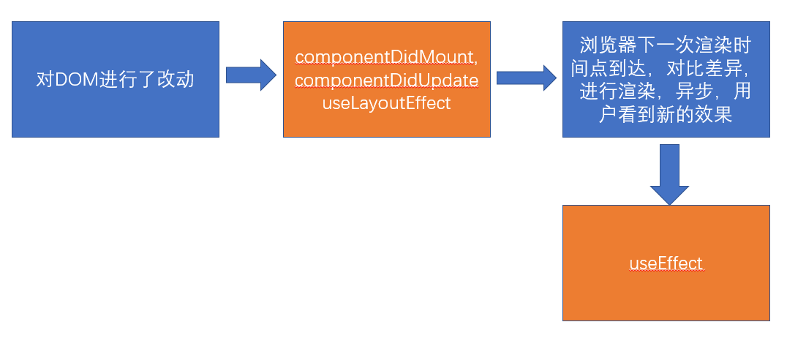

## HOOK 简介

组件：无状态组件（函数组件）、类组件
类组件中的麻烦：

1.  this 指向问题
2.  繁琐的生命周期
3.  其他问题

HOOK 专门用于增强函数组件的功能（HOOK 在类组件中是不能使用的），使之理论上可以成为类组件的替代品
官方强调：没有必要更改已经完成的类组件，官方目前没有计划取消类组件，只是鼓励使用函数组件
HOOK（钩子）本质上是一个函数(命名上总是以**use**开头)，该函数可以挂载任何功能
HOOK 种类：

1. useState 解决状态
2. useEffect 解决生命周期函数
3. 其他...

不同 HOOK 能解决某一方面的功能

### State Hook

State Hook 是一个在函数组件中使用的函数（useState），用于在函数组件中使用状态

useState

- 函数有一个参数，这个参数的值表示状态的默认值
- 函数的返回值是一个数组，该数组一定包含两项
  - 第一项：当前状态的值
  - 第二项：改变状态的函数

一个函数组件中可以有多个状态，这种做法非常有利于横向切分关注点。
函数组件的写法

```jsx
import React, { useState } from "react";
// 函数组件的写法
export default function App() {
  // const arr = useState(0); // 不填默认undefined。使用一个状态，该状态默认值是0
  // const n = arr[0]; //得到状态的值
  // const setN = arr[1]; //得到一个函数，改函数用于改变状态
  // 解构语法简化：
  const [n, setN] = useState(0);
  return (
    <div>
      <button
        onClick={() => {
          setN(n - 1);
        }}
      >
        -
      </button>
      <span>{n}</span>
      <button
        onClick={() => {
          setN(n + 1);
        }}
      >
        +
      </button>
    </div>
  );
}
```

原理


**注意的细节**

1. useState 最好写到函数的起始位置，便于阅读
2. useState 严禁出现在代码块（判断、循环）中
3. useState 返回的函数（数组的第二项），引用不变（节约内存空间）
4. 使用函数改变数据，若数据和之前的数据完全相等（使用 Object.is 比较），不会导致重新渲染，以达到优化效率的目的。
5. 使用函数改变数据，传入的值不会和原来的数据进行合并，而是直接替换。不要直接改变对象。setState 是用混合。
   > 应该横切开来，写第二个状态。如果的确需要在一起，就用展开运算符

```jsx
export default function App() {
  const [data, setData] = useState({
    x: 1,
    y: 2,
  });
  return (
    <p>
      x:{data.x},y:{data.y}
      <button
        onClick={() => {
          setData({
            ...data,
            x: data.x + 1,
          });
        }}
      >
        x+1
      </button>
    </p>
  );
}
```

6. 如果要实现强制刷新组件

类组件：使用 forceUpdate 函数。不运行 shouldComponentUpdate
函数组件：使用一个空对象的 useState

```jsx
import React, { useState } from "react";
export default function App() {
  console.log("App render");
  const [, forceUpdate] = useState({});
  return (
    <div>
      <p>
        <button
          onClick={() => {
            forceUpdate({});
          }}
        >
          强制刷新
        </button>
      </p>
    </div>
  );
}
```

7. **如果某些状态之间没有必然的联系，应该分化为不同的状态，而不要合并成一个对象**
8. 和类组件的状态一样，函数组件中改变状态可能是异步的（在 DOM 事件中），多个状态变化会合并以提高效率，此时，不能信任之前的状态，而应该使用回调函数的方式改变状态。如果状态变化要使用到之前的状态，尽量传递函数。

```jsx
import React, { useState } from "react";
export default function App() {
  console.log("render"); //两次改变合并成一个，只运行一次
  const [n, setN] = useState(0);
  return (
    <div>
      <span>{n}</span>
      <button
        onClick={() => {
          // setN(n + 1); // 不会立即改变，事件运行完成后一起改变
          // setN(n + 1); // 此时n仍是0
          setN((prevN) => prevN + 1); // 传入的函数，在事件完成后统一运行
          setN((prevN) => prevN + 1);
        }}
      >
        +
      </button>
    </div>
  );
}
```

### Effect Hook

副作用：生命周期 componentDidMount，componentDidUpdate，componentWillUnmount 才能有副作用，其他都不能，因为都可能调用两遍，服务端渲染可能出问题

Effect Hook：用于在函数组件中处理副作用
副作用：

1. ajax 请求
2. 计时器
3. 其他异步操作
4. 更改真实 DOM 对象
5. 本地存储
6. 其他会对外部产生影响的操作

函数：useEffect，该函数接收一个函数作为参数，接收的函数就是需要进行副作用操作的函数

```jsx
export default function EffectHook() {
  const [n, setN] = useState(0);
  useEffect(() => {
    document.title = n;
  });
  return (
    <div>
      <button onClick={() => setN(n + 1)}>+</button>
      {n}
    </div>
  );
}
```

**细节**

1. 副作用函数的运行时间点，是在页面完成真实的 UI 渲染之后。因此它的执行是异步的，并且不会阻塞浏览器 。所以会有些延迟

与类组件中 componentDidMount 和 componentDidUpdate 的区别
componentDidMount 和 componentDidUpdate，更改了真实 DOM，但是用户还没有看到 UI 更新，同步的。
useEffect 中的副作用函数，更改了真实 DOM，并且用户已经看到了 UI 更新，异步的。

2. 每个函数组件中，可以多次使用 useEffect，但不要放入判断或循环等代码块中。
3. useEffect 中的副作用函数，可以有返回值，返回值必须是一个函数，该函数叫做清理函数
   1. 该函数运行时间点，在每次运行副作用函数之前
   2. 首次渲染组件不会运行
   3. **组件被销毁时一定会运行 window.timer => null**
4. useEffect 函数，可以传递第二个参数
   1. 第二个参数是一个数组
   2. 数组中记录该副作用的依赖数据
   3. 当组件重新渲染后，只有依赖数据与上一次不一样的时，才会执行副作用
   4. 所以，当传递了依赖数据之后，如果数据没有发生变化
      1. 副作用函数仅在第一次渲染后运行
      2. 清理函数仅在卸载组件后运行
5. 副作用函数中，如果使用了函数上下文中的变量，则由于闭包的影响，会导致副作用函数中变量不会实时变化。
   

6. 副作用函数在每次注册时，会覆盖掉之前的副作用函数，因此，尽量保持副作用函数稳定，否则控制起来会比较复杂。

### 自定义 Hook

State Hook： useState
Effect Hook：useEffect

自定义 Hook：将一些常用的、跨越多个组件的 Hook 功能，抽离出去形成一个函数，该函数就是自定义 Hook，自定义 Hook，由于其内部需要使用 Hook 功能，所以它本身也需要按照 Hook 的规则实现：

1. 函数名必须以 use 开头
2. 调用自定义 Hook 函数时，应该放到顶层

例如：

1. 很多组件都需要在第一次加载完成后，获取所有学生数据
2. 很多组件都需要在第一次加载完成后，启动一个计时器，然后在组件销毁时卸载

> 使用 Hook 的时候，如果没有严格按照 Hook 的规则进行，eslint 的一个插件（eslint-plugin-react-hooks）会报出警告

### Reducer Hook

Flux：Facebook 出品的一个数据流框架

1. 规定了数据是单向流动的
2. 数据存储在数据仓库中（目前，可以认为 state 就是一个存储数据的仓库）
3. **action 是改变数据的唯一原因**（本质上就是一个对象，action 有两个属性）
   1. type：字符串，动作的类型
   2. payload：任意类型，动作发生后的附加信息
   3. 例如，如果是添加一个学生，action 可以描述为：
      1. `{ type:"addStudent", payload: {学生对象的各种信息} }`
   4. 例如，如果要删除一个学生，action 可以描述为：
      1. `{ type:"deleteStudent", payload: 学生id }`
4. **具体改变数据**的是一个函数，该函数叫做**reducer**
   1. 该函数接收两个参数
      1. state：表示当前数据仓库中的数据
      2. action：描述了如何去改变数据，以及改变数据的一些附加信息
   2. 该函数必须有一个返回结果，用于表示数据仓库变化之后的数据
      1. Flux 要求，对象是不可变的，如果返回对象，必须创建新的对象
   3. reducer 必须是纯函数，不能有任何副作用
5. 如果要触发 reducer，**不可以直接调用**，而是应该调用一个辅助函数**dispatch**
   1. 该函数仅接收一个参数：action
   2. 该函数会间接去调用 reducer，以达到改变数据的目的

### Context Hook

用于获取上下文数据

### Callback Hook

函数名：useCallback

用于得到一个固定引用值的函数，通常用它进行性能优化

useCallback:

该函数有两个参数：

1. 函数，useCallback 会固定该函数的引用，**只要依赖项没有发生变化，则始终返回之前函数的地址**
2. 数组，记录依赖项

该函数返回：引用相对固定的函数地址

### Memo Hook

用于保持一些比较稳定的数据，通常用于性能优化

**如果 React 元素本身的引用没有发生变化，一定不会重新渲染**

### Ref Hook

useRef 函数：

1. 一个参数：默认值
2. 返回一个**固定的对象**，`{current: 值}`

**可以做到每一个组件有一个唯一地址**

### ImperativeHandle Hook

函数：useImperativeHandleHook

### LayoutEffect Hook



useEffect：浏览器渲染完成后，用户看到新的渲染结果之后

useLayoutEffectHook：完成了**DOM**改动，但还没有呈现给用户运行

**应该尽量使用 useEffect，因为它不会导致渲染阻塞**，如果出现了问题，再考虑使用 useLayoutEffectHook。使用上和 useEffect 没有区别

### DebugValue Hook

useDebugValue：用于将自定义 Hook 的关联数据显示到调试栏

如果创建的自定义 Hook 通用性比较高，可以选择使用 useDebugValue 方便调试
