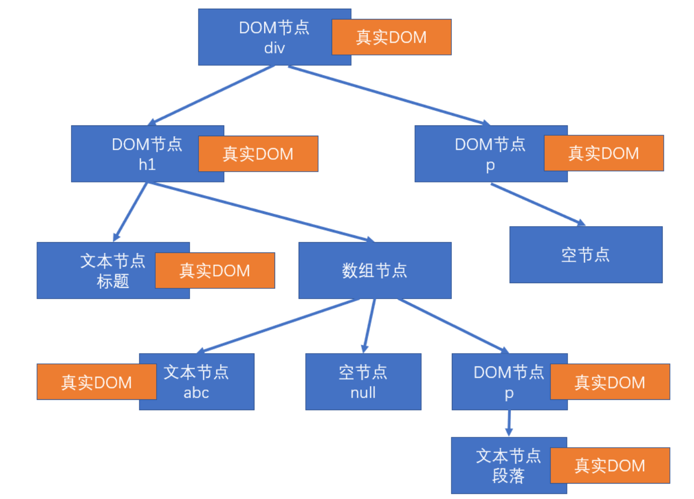
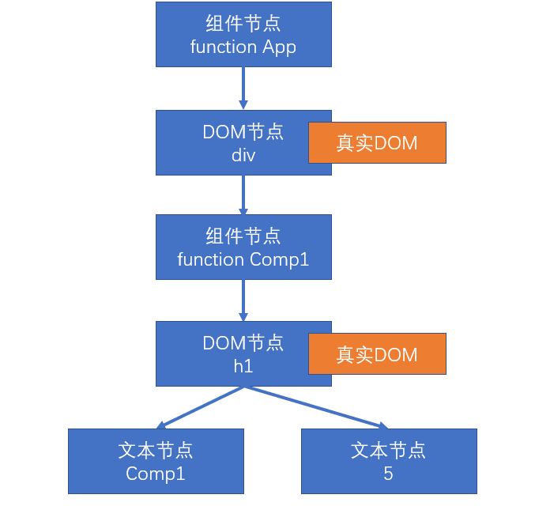
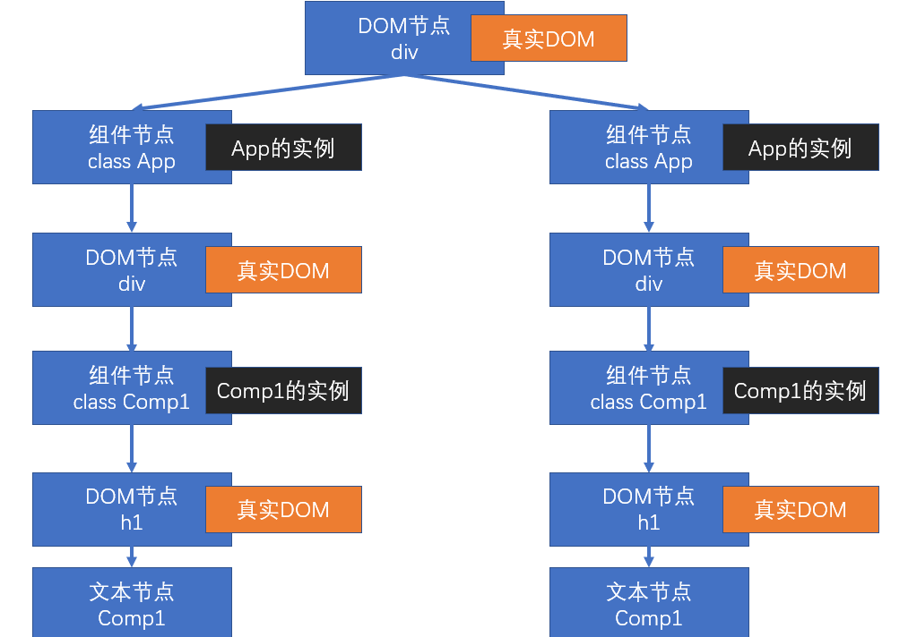
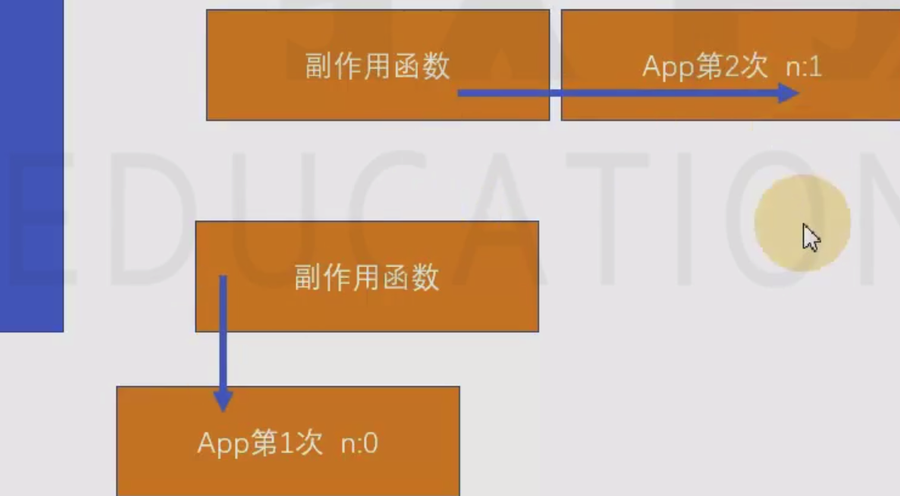

# React onePage

React 是由**Facebook**研发的、用于**解决 UI 复杂度**的开源**JavaScript 库**，目前由 React 联合社区维护。

> 它不是框架，只是为了解决 UI 复杂度而诞生的一个库，并不是 MVVM MVC

## React 的特点

- 轻量：React 的开发版所有源码（包含注释）仅 3000 多行
- 原生：所有的 React 的代码都是用原生 JS 书写而成的，不依赖其他任何库
- 易扩展：React 对代码的封装程度较低，也没有过多的使用魔法，所以 React 中的很多功能都可以扩展。
- 不依赖宿主环境：React 只依赖原生 JS 语言，不依赖任何其他东西，包括运行环境。因此，它可以被轻松的移植到浏览器、桌面应用、移动端。
- 渐近式：React 并非框架，对整个工程没有强制约束力。这对与那些已存在的工程，可以逐步的将其改造为 React，而不需要全盘重写。
- 单向数据流：所有的数据自顶而下的流动
- 用 JS 代码声明界面
- 组件化

## Hello World

```html
<!-- React的核心库，与宿主环境无关 -->
<script
  crossorigin
  src="https://unpkg.com/react@16/umd/react.development.js"
></script>
<!-- 依赖核心库，将核心的功能与页面结合 -->
<script
  crossorigin
  src="https://unpkg.com/react-dom@16/umd/react-dom.development.js"
></script>
crossorigin跨域。script本身可以跨域，为何还要加呢？报错会显示详细信息
```

## React.createElement

创建一个**React 元素**，称作虚拟 DOM，**本质上是一个对象**

1. 参数 1：元素类型，如果是字符串，一个普通的 HTML 元素
2. 参数 2：元素的属性，一个对象
3. 后续参数：元素的子节点

最原始的写法：

```javascript
// 创建一个span元素
var span = React.createElement("span", {}, "一个span元素");
// 创建一个h1元素
创建一个H1元素;
var h1 = React.createElement(
  "h1",
  {
    title: "第一个React元素",
  },
  "Hello",
  "World",
  span
);
ReactDOM.render(h1, document.getElementById("root"));
```

> React 本质：createElement 创建一个对象，把这些对象形成一种结构，最终交给 ReactDOM 渲染到页面上

## JSX

JS 的扩展语法，需要使用 babel 进行转义。

```html
<!-- 编译JSX -->
<script src="https://unpkg.com/babel-standalone@6/babel.min.js"></script>
<script type="text/babel">
  // 创建一个span元素
  var span = <span>一个span元素</span>;
  // 创建一个H1元素
  var h1 = (
    <h1 title="第一个React元素">
      Hello World <span>一个span元素</span>
    </h1>
  );
  console.log(h1);
  // 等价于直接写    最终都会转成React.createElement来执行
  // ReactDOM.render(<h1 title="第一个React元素">Hello World <span>一个span元素</span></h1>, document.getElementById("root"));
</script>
```

emmet 配置：emmet 语法书写代码

```json
"javascript": "javascriptreact"
```

ESLint：代码风格检查：合适的时候提出警告

ES7 React/Redux/GraphQL/React-Native snippets：快速代码编写

React Developer Tools

## 什么是 JSX

- Facebook 起草的 JS 扩展语法
- 本质是一个 JS 对象，会被 babel 编译，最终会被转换为 React.createElement
- 每个 JSX 表达式，有且仅有一个根节点。原因：最终 React.createElement。

  - React.Fragment 简写为 <></>
  - 每个 JSX 元素必须结束（XML 规范）

- 在 JSX 中嵌入表达式
- 将表达式作为内容的一部分
  - null、undefined、false 不会显示
  - 普通对象，不可以作为子元素
  - 可以放置 React 元素对象
  - 数组：遍历数组，把数组的每一个元素当成子元素加进来，undefined null false 不会算，放普通对象会出错
- 将表达式作为元素属性
- 属性使用小驼峰命名法
- 防止注入攻击
  - 自动编码
  - dangerouslySetInnerHTML

```javascript
import React from "react";
import ReactDOM from "react-dom";
const a = 1234,
  b = 2345;

const div = (
  <h1>
    {a} * {b} = {a * b};
  </h1>
);
// 底层实现上
// const div = React.createElement("div",{},`${a}*${b} = ${a*b}`)
ReactDOM.render(div, document.getElementById("root"));
```

## 元素的不可变性

- 虽然 JSX 元素是一个对象，但是该对象中的所有属性不可更改

```javascript
div.props.num = 2;
div.props.title = "sac";
// 不能重新设置的原因：Object.freeze了
```

- 如果确实需要更改元素的属性，需要重新创建 JSX 元素

```javascript
import React from "react";
import ReactDOM from "react-dom";
let num = 0;
setInterval(() => {
  num++;
  const div = <div title="asa">{num}</div>;
  ReactDOM.render(div, document.getElementById("root"));
}, 1000);
```

> DOM 优化：效率很高，只变动 div 的内容

1. 函数组件

返回一个 React 元素

2. 类组件

必须继承 React.Component
必须提供 render 函数，用于渲染组件

## 组件的属性

1. 对于函数组件，属性会作为一个对象的属性，传递给函数的参数
2. 对于类组件，属性会作为一个对象的属性，传递给构造函数的参数

注意：组件的属性，应该使用小驼峰命名法

**组件无法改变自身的属性**。（只读）

之前学习的 React 元素，本质上，就是一个组件（内置组件） （都只读）

React 中的哲学：数据属于谁，谁才有权力改动（父组件也无权改）

**React 中的数据，自顶而下流动**

## 组件状态

组件状态：组件可以自行维护的数据

组件状态仅在类组件中有效

状态（state），本质上是类组件的一个属性，是一个对象

### 状态初始化

方法 1

```javascript
class Demo {
  constructor(props) {
    super(props);
    this.state = {
      left: this.props.left,
    };
  }
}
```

方法 2

```javascript
state = {
  left: this.props.number,
};
```

### 状态的变化

不能直接改变状态：因为 React 无法监控到状态发生了变化
必须使用 this.setState({})改变状态
一旦调用了 this.setState，会导致当前组件重新渲染

**组件中的数据**

1. props：该数据是由组件的使用者传递的数据，所有权不属于组件自身，因此组件无法改变该数据
2. state：该数据是由组件自身创建的，所有权属于组件自身，因此组件有权改变该数据。只有组件自身可以改

## 事件

在 React 中，组件的事件，本质上就是一个属性
**如果没有特殊处理，在事件处理函数中，this 指向 undefined**

1. 使用 bind 函数，绑定 this
2. 使用箭头函数

## 深入认识 setState

setState，它对状态的改变，**可能**是异步的

> 如果改变状态的代码处于某个 HTML 元素的事件中，则其是异步的，否则是同步

如果遇到某个事件中，需要同步调用多次，需要使用函数的方式得到最新状态

最佳实践：

1. 把所有的 setState 当作是异步的
2. 永远不要信任 setState 调用之后的状态
3. 如果要使用改变之后的状态，需要使用回调函数（setState 的第二个参数）
4. 如果新的状态要根据之前的状态进行运算，使用函数的方式改变状态（setState 的第一个函数）

React 会对异步的 setState 进行优化，将多次 setState 进行合并（将多次状态改变完成后，再统一对 state 进行改变，然后触发 render）

## 生命周期

生命周期：组件从诞生到销毁会经历一系列的过程，该过程就叫做生命周期。React 在组件的生命周期中提供了一系列的钩子函数（类似于事件），可以让开发者在函数中注入代码，这些代码会在适当的时候运行。
**生命周期仅存在于类组件中，函数组件每次调用都是重新运行函数，旧的组件即刻被销毁**

## 旧版生命周期

React < 16.0.0

1. constructor
   1. 同一个组件对象只会创建一次
   2. 不能在第一次挂载到页面之前，调用 setState，为了避免问题，构造函数中严禁使用 setState

- 因为 setState 会导致重新渲染，在挂载之前，没必要重新渲染

2. componentWillMount

   1. 正常情况下，和构造函数一样，它只会运行一次
   2. 可以使用 setState，但是为了避免 bug，不允许使用，因为在某些特殊情况下，该函数可能被调用多次

3. **render**

   1. 返回一个虚拟 DOM，会被挂载到虚拟 DOM 树中，最终渲染到页面的真实 DOM 中
   2. render 可能不只运行一次，只要需要重新渲染，就会重新运行
   3. 严禁使用 setState，因为可能会导致无限递归渲染

4. **componentDidMount**

   1. 只会执行一次
   2. 可以使用 setState
   3. 通常情况下，会将网络请求、启动计时器等一开始需要的操作，书写到该函数中

5. 组件进入活跃状态
6. componentWillReceiveProps

   1. 即将接收新的属性值
   2. 参数为新的属性对象
   3. 该函数可能会导致一些 bug，所以不推荐使用

7. **shouldComponentUpdate**

   1. 指示 React 是否要重新渲染该组件，通过返回 true 和 false 来指定
   2. 默认情况下，会直接返回 true
   3. 属性直接被赋值了，不一定要值变化

8. componentWillUpdate

   1. 组件即将被重新渲染

9. componentDidUpdate

   1. 往往在该函数中使用 dom 操作，改变元素

10. **componentWillUnmount**
11. 通常在该函数中销毁一些组件依赖的资源，比如计时器


## 新版生命周期

React >= 16.0.0

React 官方认为，某个数据的来源必须是单一的。要么来自属性，要么来自状态。

1. getDerivedStateFromProps

   1. 通过参数可以获取新的属性和状态
   2. 该函数是静态的
   3. 该函数的返回值会覆盖掉组件状态
   4. 该函数几乎是没有什么用

2. getSnapshotBeforeUpdate
   1. 运行时间：真实的 DOM 构建完成，但还未实际渲染到页面中。
   2. 在该函数中，通常用于实现一些附加的 dom 操作
   3. 该函数的返回值，会作为 componentDidUpdate 的第三个参数
   4. 配合 componentDidUpdate 使用


# 传递元素内容

内置组件：div、h1、p

```html
<div>asdfafasfafasdfasdf</div>
```

index.js

```jsx
ReactDOM.render(<New html={<h1>sss</h1>} />, document.getElementById("root"));
```

new.js

```jsx
export default function New(props) {
  return <div className="comp">{props.html}</div>;
}
```

如果给自定义组件传递元素内容，则 React 会将元素内容作为 children 属性传递过去。
传递多个：

```jsx
export default function Comp(props) {
  return (
    <div>
      {props.children}
      {props.content1}
      {props.content2}
    </div>
  );
}

function Test() {
  return (
    <div>
      <Comp content1={<h1>demo</h1>} content2={<h2>demo</h2>}>
        <div>children</div>
      </Comp>
    </div>
  );
}
```

# 表单

受控组件和非受控组件

受控组件：组件的使用者，有能力完全控制该组件的行为和内容。通常情况下，受控组件往往没有自身的状态，其内容完全收到属性的控制。

非受控组件：组件的使用者，没有能力控制该组件的行为和内容，组件的行为和内容完全自行控制。

**表单组件，默认情况下是非受控组件，一旦设置了表单组件的 value 属性，则其变为受控组件(单选和多选框需要设置 checked)**

# 属性默认值 和 类型检查

## 属性默认值

之前是用混入解决的：Object.assign({},defaultProps,props)
通过一个静态属性`defaultProps`告知 react 属性默认值
函数本身的属性：函数也是对象
混合完成时间：

1. 函数组件：调用函数之前就完成了
2. 类组件：运行构造函数之前完成

```javascript
// 函数组件

export default function Comp(props) {
    console.log(props)// 已经完成了混合
    return (
        <div>Comp</div>
    )
}
Comp.defaultProps = {
    a: 1,
    b: 2
}

/// 类组件
export default class Comp extends Component {
    // static defaultProps = {
    //     a: 1,
    //     b: 2
    // }
    render() {
        return (
            <div>index</div>
        )
    }
}
// 类的本质也是函数
Comp.defaultProps = {
    a: 1
}

```

## 属性类型检查

使用库：`prop-types`
对组件使用静态属性`propTypes`告知 react 如何检查属性
如果不按照类型传递属性的话，报警告，不影响代码执行。（只在开发阶段报警告）
可以不传递，但是一旦传递，必须正确

```javascript
PropTypes.any：//任意类型  通常用在列出所有属性，方便阅读；可以设置必填
PropTypes.array：//数组类型
PropTypes.bool：//布尔类型
PropTypes.func：//函数类型  事件
PropTypes.number：//数字类型
PropTypes.object：//对象类型
PropTypes.string：//字符串类型
PropTypes.symbol：//符号类型

PropTypes.node：
//任何可以被渲染的内容，字符串、数字、React元素。如果传递null undefined，没有报错，因为没有进行非空验证
PropTypes.element：//react元素
PropTypes.elementType：//react元素类型
PropTypes.instanceOf(构造函数)：//必须是指定构造函数的实例
PropTypes.oneOf([xxx, xxx])：//枚举
PropTypes.oneOfType([xxx, xxx]);  //属性类型必须是数组中的其中一个
PropTypes.arrayOf(PropTypes.XXX)：//必须是某一类型组成的数组
PropTypes.objectOf(PropTypes.XXX)：//对象由某一类型的值组成
PropTypes.shape(对象): //属性必须是对象，并且满足指定的对象要求
PropTypes.exact({...})：//和shape一样，只是exact要求对象必须精确匹配传递的数据

//自定义属性检查，如果有错误，返回错误对象即可
属性: function(props, propName, componentName) {
}
export default class Comp extends Component {
    static propTypes = {
        score: function (props, propName, componentName) {
            const val = props[propName];
            // 必填
            if (val === undefined || val === null) return new Error('Invalid')
            // 必须是数字
            if (typeof val !== 'number') return new Error('Invalid')
        }
    }
    render() {
        return (
            <div>
                {this.props.score}
            </div>
        )
    }
}
```

# HOC 高阶组件

HOF：Higher-Order Function, 高阶函数，以函数作为参数，并返回一个函数

HOC: Higher-Order Component, 高阶组件，以组件作为参数，并返回一个组件

通常，可以利用 HOC 实现横切关注点。

> 举例：20 个组件，每个组件在创建组件和销毁组件时，需要作日志记录
> 20 个组件，它们需要显示一些内容，得到的数据结构完全一致

**注意**

1. 不要在 render 中使用高阶组件。在 render 内部的话重新创建，失去状态，浪费效率。在 render 外部则使用的是同一个类。
2. 不要在高阶组件内部更改传入的组件（防止混乱）

# ref

场景：希望直接使用 dom 元素中的某个方法，或者希望直接使用自定义组件中的某个方法

1. ref 作用于内置的 html 组件，得到的将是真实的 dom 对象
2. ref 作用于类组件，得到的将是类的实例
3. ref 不能作用于函数组件

```jsx
import React, { Component } from "react";

/**
 * 类组件
 */
class A extends Component {
  method() {
    console.log("调用了A组件的方法");
  }
  render() {
    return <h1>组件A</h1>;
  }
}

/**
 * 内置html组件
 */
export default class Comp extends Component {
  handleClick = () => {
    // console.log(this)
    this.refs.txt.focus();
    this.refs.compA.method();
  };
  render() {
    return (
      <div>
        <input type="text" ref="txt" />
        <A ref="compA" />
        <button onClick={this.handleClick}>聚焦</button>
      </div>
    );
  }
}
```

以上：ref 不再推荐使用字符串赋值，字符串赋值的方式将来可能会被移出。（效率低）
目前，ref 推荐使用对象或者是函数
**对象**
通过 React.createRef 函数创建

```jsx
import React, { Component } from "react";

export default class Comp extends Component {
  constructor(props) {
    super(props);
    /* 
            方法2：这样创建对象也可以
          this.txt = {
            current: null
        } */
    // 方法1 createRef
    this.txt = React.createRef();
    console.log(this.txt); //{current: null}
    // 第一次渲染的时候会给current赋值
    // current: input
  }
  handleClick = () => {
    // console.log(this)
    this.txt.current.focus();
  };
  render() {
    return (
      <div>
        <input ref={this.txt} type="txt" />
        <button onClick={this.handleClick}>聚焦</button>
      </div>
    );
  }
}
```

**函数**
函数的调用时间：

1. componentDidMount 的时候会调用该函数
   1. 在 componentDidMount 事件中可以使用 ref
2. 如果 ref 的值发生了变动（旧的函数被新的函数替代），分别调用旧的函数以及新的函数，时间点出现在 componentDidUpdate 之前
   1. 旧的函数被调用时，传递 null
   2. 新的函数被调用时，传递对象
3. 如果 ref 所在的组件被卸载，会调用函数

**谨慎使用 ref**

能够使用属性和状态进行控制，就不要使用 ref。

1. 调用真实的 DOM 对象中的方法
2. 某个时候需要调用类组件的方法

# Ref 转发

forwardRef
forwardRef 方法：

1. 参数，传递的是函数组件，不能是类组件，并且，函数组件需要有第二个参数来得到 ref
2. 返回值，返回一个新的组件

```jsx
import React, { Component } from "react";

function A(props, ref) {
  // console.log(props, ref)
  /*  return <h1>组件A
         <span>{props.word}</span>
     </h1> */
  return (
    <h1 ref={ref}>
      组件A
      <span>{props.word}</span>
    </h1>
  );
}
// 传递函数组件A，得到一个新组件NewA
const NewA = React.forwardRef(A); //一旦经过了这个操作，ref代表的就由函数组件自己控制了

export default class App extends Component {
  ARef = React.createRef();
  // componentDidMount() {
  //     console.log(this.ARef)//null  啥都得不到，让我自己去控制。依靠第二个参数了
  // }

  render() {
    return (
      <div>
        {/* <A ref={this.ARef} /> */}
        {/* 木得：this.ARef.current:h1即组件内部的根元素 */}
        <NewA ref={this.ARef} word="aa" />
      </div>
    );
  }
}
```

类组件咋办呢？

方法 1

```jsx
import React, { Component } from "react";

/**
 * ref:就是一个对象
 * ref:{
 *  current:null
 * }
 */
class A extends React.Component {
  render() {
    return (
      <h1 ref={this.props.ref1}>
        组件A
        <span>{this.props.words}</span>
      </h1>
    );
  }
}
export default class App extends Component {
  ARef = React.createRef();
  componentDidMount() {
    console.log(this.ARef);
  }
  render() {
    return (
      <div>
        <A ref1={this.ARef} words="aa" />
      </div>
    );
  }
}
```

方法 2

```jsx
import React, { Component } from "react";

class A extends React.Component {
  render() {
    return (
      <h1 ref={this.props.abc}>
        组件A
        <span>{this.props.words}</span>
      </h1>
    );
  }
}
/**
 * 函数包装一下
 */
const NewA = React.forwardRef((props, ref) => {
  return <A {...props} abc={ref} />;
});
export default class App extends Component {
  ARef = React.createRef();
  componentDidMount() {
    console.log(this.ARef);
  }

  render() {
    return (
      <div>
        <NewA ref={this.ARef} words="aa" />
      </div>
    );
  }
}
```

**高阶组件**

```jsx
import React from "react";
import { A } from "./components/Comp";
import withLog from "./HOC/withLog";
let AComp = withLog(A);

export default class App extends React.Component {
  myRef = React.createRef();
  componentDidMount() {
    console.log(this.myRef); //logwrapper
  }
  render() {
    return (
      <div>
        {/* ref:代表了日志记录了，但是我想代表A */}
        <AComp ref={this.myRef} />
      </div>
    );
  }
}
```

改装 withLog.js

```javascript
import React from "react";

/**
 * 高阶组件
 * @param {*} comp 组件
 */
export default function withLog(Comp) {
  class LogWrapper extends React.Component {
    componentDidMount() {
      console.log(`日志：组件${Comp.name}被创建了！${Date.now()}`);
    }
    componentWillUnmount() {
      console.log(`日志：组件${Comp.name}被销毁了！${Date.now()}`);
    }
    render() {
      //正常的属性
      //forwardRef代表要转发的ref  {current:null}
      const { forwardRef, ...rest } = this.props;
      return (
        <>
          <Comp ref={forwardRef} {...rest} /> 最终，current指向他
        </>
      );
    }
  }

  return React.forwardRef((props, ref) => {
    return <LogWrapper {...props} forwardRef={ref} />;
  });
}
```

# Context

上下文：Context，表示做某一些事情的环境
React 中的上下文特点：

1. 当某个组件创建了上下文后，上下文中的数据，会被所有后代组件共享
2. 如果某个组件依赖了上下文，会导致该组件不再纯粹（纯粹指的是外部数据仅来源于属性 props）
3. 一般情况下，用于第三方组件（通用组件）

## 旧的 API

> **创建上下文**

只有类组件才可以创建上下文

1. 给类组件书写静态属性 **childContextTypes**，使用该属性对上下文中的数据类型进行约束
2. 添加实例方法 **getChildContext**，该方法返回的对象，即为上下文中的数据，该数据必须满足类型约束，该方法会在每次 render 之后运行。

> **使用上下文中的数据**

要求：如果要使用上下文中的数据，组件必须有一个静态属性 **contextTypes**，该属性描述了需要获取的上下文中的数据类型。

1. 可以在组件的构造函数中，通过第二个参数，获取上下文数据。但是由于构造函数只会运行一次，后面上下文数据改变了，不会更新
2. **从组件的 context 属性中获取**
3. 在函数组件中，通过第二个参数，获取上下文数据。数据并不会流动异常，只是调用了父组件的函数而已
   > **创建上下文只能是类组件，获取上下文可以是类组件或函数组件**

```jsx
import React, { Component } from "react";
import PropTypes from "prop-types";
const types = {
  a: PropTypes.number,
  b: PropTypes.string.isRequired,
};
function ChildA(props, context) {
  // 在函数组件中，通过第二个参数，获取上下文数据
  return (
    <div>
      <h1>ChildA</h1>
      <h2>
        a{context.a} ; b{context.b}
      </h2>
      <ChildB />
    </div>
  );
}
ChildA.contextTypes = types; //前提条件contextTypes

class ChildB extends React.Component {
  static contextTypes = types;
  // 方法2：从组件的context属性中获取
  constructor(props, context) {
    super(props, context);
    console.log(this.context);
  }
  // 如果不写构造函数，会自动运行super
  render() {
    return (
      <p>
        ChildB 来自于上下文的数据 a:{this.context.a}, b:{this.context.b}
      </p>
    );
  }
}
export default class OldContext extends Component {
  /**
   * 约束上下文中数据的类型
   */
  static childContextTypes = types;
  /**
   *
   * @returns 得到上下文数据
   */
  getChildContext() {
    console.log("获取上下文中的数据");
    return {
      a: 123,
      b: "aaa",
    };
  }
  render() {
    return (
      <div>
        <ChildA />
      </div>
    );
  }
}
```

> **上下文的数据变化**

上下文中的数据不可以直接变化，最终都是通过状态改变

```jsx
export default class OldContext extends Component {
  /**
   * 约束上下文中数据的类型
   */
  static childContextTypes = types;
  state = {
    a: 123,
    b: "abc",
  };
  /**
   *
   * @returns 得到上下文数据
   */
  getChildContext() {
    console.log("获取新的上下文");
    return {
      a: this.state.a, //来自状态了
      b: this.state.b,
    };
  }
  render() {
    return (
      <div>
        <ChildA />
        <button
          onClick={() => {
            this.setState({
              //每次改变状态都会重新运行getChildContext。会导致重新渲染
              a: this.state.a + 1,
            });
          }}
        >
          a+1
        </button>
      </div>
    );
  }
}
```

在上下文中加入一个处理函数，**可以用于后代组件更改上下文的数据**

```jsx
import React, { Component } from "react";
import PropTypes from "prop-types";
const types = {
  a: PropTypes.number,
  b: PropTypes.string.isRequired,
  onChangeA: PropTypes.func,
};
function ChildA(props, context) {
  return (
    <div>
      <h1>ChildA</h1>
      <h2>
        a{context.a} ; b{context.b}
      </h2>
      <ChildB />
    </div>
  );
}
ChildA.contextTypes = types; //前提条件contextTypes

class ChildB extends React.Component {
  static contextTypes = types;
  constructor(props, context) {
    super(props, context);
    console.log(this.context);
  }
  render() {
    return (
      <p>
        ChildB 来自于上下文的数据 a:{this.context.a}, b:{this.context.b}
        <button
          onClick={() => {
            this.context.onChangeA(this.context.a + 2);
          }}
        >
          子组件按钮a+2
        </button>
      </p>
    );
  }
}
export default class OldContext extends Component {
  static childContextTypes = types;
  state = {
    a: 123,
    b: "abc",
  };
  getChildContext() {
    return {
      a: this.state.a,
      b: this.state.b,
      onChangeA: (newA) => {
        //这里要用箭头函数，否则报错
        this.setState({
          a: newA,
        });
      },
    };
  }
  render() {
    return (
      <div>
        <ChildA />
        <button
          onClick={() => {
            this.setState({
              a: this.state.a + 1,
            });
          }}
        >
          a+1
        </button>
      </div>
    );
  }
}
```

## 新版 API

旧版 API 存在严重的效率问题，并且容易导致滥用

**创建上下文**

上下文是一个独立于组件的对象，该对象通过 React.createContext(默认值)创建

返回的是一个包含两个属性的对象

1. Provider 属性：生产者。一个组件，该组件会创建一个上下文，该组件有一个 value 属性，通过该属性，可以为其数据赋值
   1. 同一个 Provider，不要用到多个组件中，如果需要在其他组件中使用该数据，应该考虑将数据提升到更高的层次

> 使用类组件获取上下文

```jsx
import React, { Component } from "react";

const ctx = React.createContext(); //里面可以填默认值

// console.log(ctx)

function ChildA(props) {
  return (
    <div>
      <h1>ChildA</h1>
      <ChildB />
    </div>
  );
}

class ChildB extends React.Component {
  static contextType = ctx;
  render() {
    return (
      <div>
        ChildB,来自上下文的数据：a:{this.context.a},b:{this.context.b}
        <button
          onClick={() => {
            this.context.changeA(this.context.a + 2);
          }}
        >
          后代组件的按钮，点击a+2
        </button>
      </div>
    );
  }
}
export default class NewContext extends Component {
  state = {
    a: 0,
    b: "abc",
    changeA: (newA) => {
      this.setState({
        a: newA,
      });
    },
  };
  /* render() {
        const Provider = ctx.Provider;//可以把ctx.Provider直接当组件用<ctx.Provider></ctx.Provider>
        return (
            <Provider value={this.state}>
                <div></div>
            </Provider>
        )
    } */
  render() {
    return (
      <ctx.Provider value={this.state}>
        <div>
          <ChildA />
          <button
            onClick={() => {
              this.setState({
                a: this.state.a + 1,
              });
            }}
          >
            父组件的按钮a+1
          </button>
        </div>
      </ctx.Provider>
    );
  }
}
```

2. Consumer 属性：后续讲解

**使用上下文中的数据**

1. 在类组件中，直接使用 this.context 获取上下文数据
   1. 要求：必须拥有静态属性 contextType , 应赋值为创建的上下文对象
2. 在函数组件中，需要使用 Consumer 来获取上下文数据
   1. Consumer 是一个组件
   2. 它的子节点，是一个函数（它的 props.children 需要传递一个函数）
   3. 不需要写静态属性
      > 使用函数组件获取上下文

```jsx
const ctx = React.createContext();
function ChildA(props) {
  return (
    <div>
      <h1>ChildA</h1>
      <h2>
        {/* 
                写法1
               <ctx.Consumer>
                  这里已经明确使用哪个上下文了，不用写静态属性了
                    {value => <>{value.a},{value.b}</>}
                </ctx.Consumer> */}
        {/* 写法2 */}
        <ctx.Consumer
          children={(value) => (
            <>
              {value.a},{value.b}
            </>
          )}
        ></ctx.Consumer>
      </h2>
      <ChildB />
    </div>
  );
}
```

> 类组件中，也可以通过这个方法获取。比较常用，不需要 contextType 了

```javascript
class ChildB extends Component {
  render() {
    return (
      <ctx.Consumer>
        {(value) => {
          <p>
            来自上下文的数据：{value.a}
            <button onClick={value.changeA(value.a + 2)}>
              后代组件按钮，点击a+2
            </button>
          </p>;
        }}
      </ctx.Consumer>
    );
  }
}
```

> 创建多个，互不干扰

```jsx
import React, { Component } from "react";

const ctx1 = React.createContext();
const ctx2 = React.createContext();

function ChildA(props) {
  return (
    <ctx2.Provider
      value={{
        a: 789,
        c: "hello",
      }}
    >
      <div>
        <h1>ChildA</h1>
        <h2>
          <ctx1.Consumer>
            {(value) => (
              <>
                {value.a}，{value.b}
              </>
            )}
          </ctx1.Consumer>
        </h2>
        <ChildB />
      </div>
    </ctx2.Provider>
  );
}

class ChildB extends React.Component {
  render() {
    return (
      <ctx1.Consumer>
        {(value) => (
          <>
            <p>
              ChildB，来自于上下文的数据：a: {value.a}, b:{value.b}
              <button
                onClick={() => {
                  value.changeA(value.a + 2);
                }}
              >
                后代组件的按钮，点击a+2
              </button>
            </p>
            <p>
              <ctx2.Consumer>
                {(val) => (
                  <>
                    来自于ctx2的数据： a: {val.a}， c:{val.c}
                  </>
                )}
              </ctx2.Consumer>
            </p>
          </>
        )}
      </ctx1.Consumer>
    );
  }
}

export default class NewContext extends Component {
  state = {
    a: 0,
    b: "abc",
    changeA: (newA) => {
      this.setState({
        a: newA,
      });
    },
  };
  render() {
    return (
      <ctx1.Provider value={this.state}>
        <div>
          <ChildA />

          <button
            onClick={() => {
              this.setState({
                a: this.state.a + 1,
              });
            }}
          >
            父组件的按钮，a加1
          </button>
        </div>
      </ctx1.Provider>
    );
  }
}
```

**注意细节**

如果，上下文提供者（Context.Provider）中的 value 属性发生变化(Object\.is 比较)，会导致该上下文提供的所有后代元素全部重新渲染，无论该子元素是否有优化（无论 shouldComponentUpdate 函数返回什么结果）

上下文的应用场景

编写一套组件（有多个组件），这些组件之间需要相互配合才能最终完成功能

比如，我们要开发一套表单组件，使用方式如下

```jsx
render(){
  return (
    <Form onSubmit={datas=>{
        console.log(datas); //获取表单中的所有数据（对象）
        /*
                {
                    loginId:xxxx,
                    loginPwd:xxxx
                }
            */
      }}>
      <div>
        账号： <Form.Input name="loginId" />
      </div>
      <div>
        密码： <Form.Input name="loginPwd" type="password" />
      </div>
      <div>
        <Form.Button>提交</Form.Button>
      </div>
    </Form>
  );
}
```

## PureComponent

纯组件：用于避免不必要的渲染（运行 render），从而提高效率

优化：如果一个组件的属性和状态，都没有发生变化，该组件的重新渲染是没有必要的

PureComponent 是一个组件，如果某个组件继承自该组件，则该组件的 shouldComponentUpdate 会进行优化，对属性和状态进行钱比较。相等就不会重新渲染

注意场景：改动之前的数组，地址不会变化，浅比较会认为没发生变化。所以尽量不改动原数组，应该创建新数组

1. 为了效率，尽量用纯组件
2. 不要改变之前的状态，永远是创建新的状态覆盖之前的状态（Immutable 不可变对象）

```jsx
// 加入要改变对象的某个值，不要改变原对象
obj:{
	...this.state.obj,
    b:500
}
// 或者

Object.assign({},this.state.obj, {b:500})
```

3. 有一个第三方库，Immutable.js 专门用于制作不可变对象

函数组件没有生命周期，每次需要重新调用函数，要防止重新调用函数，使用 React.memo 函数制作纯组件

```jsx
export default React.memo(Task); //高阶组件  套了一层类组件
```

实现原理

```jsx
function memo(FuncComp) {
  return class Memo extends PureComponent {
    render() {
      // return <FuncComp  {...this.props}/>
      return <>{FuncComp(this.props)}</>;
    }
  };
}
```

## render props

[Render Props – React](https://zh-hans.reactjs.org/docs/render-props.html)

[https://www.bilibili.com/video/BV13k4y117UG/?spm_id_from=333.788.recommend_more_video.1&vd_source=5ca956a1f37d0ed72cd1c453c15a3c03](https://www.bilibili.com/video/BV13k4y117UG/?spm_id_from=333.788.recommend_more_video.1&vd_source=5ca956a1f37d0ed72cd1c453c15a3c03)

有时候，某些组件的各种功能及其处理逻辑几乎完全相同，只是显示的界面不一样，建议下面的方式认选其一来解决重复代码的问题（横切关注点）

1. render props
   1. 某个组件，需要某个属性
   2. 该属性是一个函数，函数的返回值用于渲染
   3. 函数的参数会传递为需要的数据
   4. 注意纯组件的属性（尽量避免每次传递的 render props 的地址不一致，应该把函数提出来）
   5. 通常该属性的名字叫做 render
2. HOC

## Portals

插槽：将一个 React 元素渲染到指定的 DOM 容器中
ReactDOM.createPortal(React 元素, 真实的 DOM 容器)，该函数返回一个 React 元素

```jsx
import React from "react";
import ReactDOM from "react-dom";
function ChildA() {
  return ReactDOM.createPortal(
    <div className="child-a">
      <h1>ChildA</h1>
      <ChildB />
    </div>,
    document.querySelector(".modal")
  );
}
function ChildB() {
  return (
    <div className="child-b">
      <h1>ChildB</h1>
    </div>
  );
}
export default function App() {
  return (
    <div className="app">
      <h1>App</h1>
      <ChildA />
    </div>
  );
}
```

现象：真实的 DOM 结构变成了代码那样，但是组件结构变化。说明 React 虚拟 DOM 树和真实 DOM 树可以有差异
**注意事件冒泡**

1. React 中的事件是包装过的
2. 它的事件冒泡是根据虚拟 DOM 树（组件结构）来冒泡的，与真实的 DOM 树无关。

```jsx
import React from "react";
import ReactDOM from "react-dom";
function ChildA() {
  return ReactDOM.createPortal(
    <div
      className="child-a"
      style={{
        marginTop: 200,
      }}
    >
      <h1>ChildA</h1>
      <ChildB />
    </div>,
    document.querySelector(".modal")
  );
}
function ChildB() {
  return (
    <div className="child-b">
      <h1>ChildB</h1>
    </div>
  );
}
export default function App() {
  return (
    <div
      className="app"
      onClick={(e) => {
        console.log("App被点击了", e.target);
      }}
    >
      <h1>App</h1>
      <ChildA />
    </div>
  );
}
```

## 错误边界

默认情况下，若一个组件在**渲染期间**（render）发生错误，会导致整个组件树全部被卸载

错误边界：是一个组件，该组件会捕获到渲染期间（render）子组件发生的错误，并有能力阻止错误继续传播

**让某个组件捕获错误**

1. 编写生命周期函数 getDerivedStateFromError
   1. 静态函数
   2. 运行时间点：渲染子组件的过程中，发生错误之后，在更新页面之前
   3. **注意：只有子组件发生错误，才会运行该函数。自己发生错误处理不了**
   4. 该函数返回一个对象，React 会将该对象的属性覆盖掉当前组件的 state
   5. 参数：错误对象
   6. 通常，该函数用于改变状态
2. 编写生命周期函数 componentDidCatch
   1. 实例方法
   2. 运行时间点：渲染子组件的过程中，发生错误，更新页面之后，由于其运行时间点比较靠后，因此不太会在该函数中改变状态
   3. 通常，该函数用于记录错误消息

**细节**

某些错误，错误边界组件无法捕获

1. 自身的错误
2. 异步的错误
3. 事件中的错误

这些错误，需要用 try catch 处理

总结：仅处理渲染子组件期间的同步错误

## React 中的事件

这里的事件：React 内置的 DOM 组件中的事件

1. 给 document 注册事件
2. 几乎所有的元素的事件处理，均在 document 的事件中处理
   1. 一些不冒泡的事件，是直接在元素上监听
   2. 一些 document 上面没有的事件，直接在元素上监听
3. 在 document 的事件处理，React 会根据虚拟 DOM 树的完成事件函数的调用
4. React 的事件参数，并非真实的 DOM 事件参数，是 React 合成的一个对象，该对象类似于真实 DOM 的事件参数
   1. stopPropagation，阻止事件在虚拟 DOM 树中冒泡
   2. nativeEvent，可以得到真实的 DOM 事件对象
   3. 为了提高执行效率，React 使用事件对象池来处理事件对象

**注意事项**

1. 如果给真实的 DOM 注册事件，阻止了事件冒泡，则会导致 react 的相应事件无法触发
2. 如果给真实的 DOM 注册事件，事件会先于 React 事件运行
3. 通过 React 的事件中阻止事件冒泡，无法阻止真实的 DOM 事件冒泡
4. 可以通过 nativeEvent.stopImmediatePropagation()，阻止 document 上剩余事件的执行
5. 在事件处理程序中，不要异步的使用事件对象，如果一定要使用，需要调用 persist 函数

# 渲染原理

渲染：生成用于显示的对象，以及将这些对象形成真实的 DOM 对象

- React 元素：React Element，通过 React.createElement 创建（语法糖：JSX）
  - 例如：
  - `<div><h1>标题</h1></div>`
  - `<App />`
- React 节点：专门用于渲染到 UI 界面的对象，React 会通过 React 元素，创建 React 节点，ReactDOM 一定是通过 React 节点来进行渲染的
- 节点类型：
  - React DOM 节点：创建该节点的 React 元素类型是一个字符串
  - React 组件节点：创建该节点的 React 元素类型是一个函数或是一个类
  - React 文本节点：由字符串、数字创建的
  - React 空节点：由 null、undefined、false、true
  - React 数组节点：该节点由一个数组创建
- 真实 DOM：通过 document.createElement 创建的 dom 元素


## 首次渲染(新节点渲染)

1. 通过参数的值创建节点
2. 根据不同的节点，做不同的事情
   1. 文本节点：通过 document.createTextNode 创建真实的文本节点
   2. 空节点：什么都不做，但是存在会占位
   3. 数组节点：遍历数组，将数组每一项递归创建节点（回到第 1 步进行反复操作，直到遍历结束）
   4. DOM 节点：通过 document.createElement 创建真实的 DOM 对象，然后立即设置该真实 DOM 元素的各种属性，然后遍历对应 React 元素的 children 属性，递归操作（回到第 1 步进行反复操作，直到遍历结束）
   5. 组件节点
      1. 函数组件：调用函数(该函数必须返回一个可以生成节点的内容)，将该函数的返回结果递归生成节点（回到第 1 步进行反复操作，直到遍历结束）
      2. 类组件：
         1. 创建该类的实例
         2. 立即调用对象的生命周期方法：static getDerivedStateFromProps
         3. 运行该对象的 render 方法，拿到节点对象（将该节点递归操作，回到第 1 步进行反复操作）
         4. 将该组件的 componentDidMount 加入到执行队列（先进先出，先进先执行），当整个虚拟 DOM 树全部构建完毕，并且将真实的 DOM 对象加入到容器中后，执行该队列
3. 生成出虚拟 DOM 树之后，将该树保存起来，以便后续使用
4. 将之前生成的真实的 DOM 对象，加入到容器中。

```javascript
const app = (
  <div className="assaf">
    <h1>
      标题
      {["abc", null, <p>段落</p>]}
    </h1>
    <p>{undefined}</p>
  </div>
);
ReactDOM.render(app, document.getElementById("root"));
```

以上代码生成的虚拟 DOM 树：



```javascript
function Comp1(props) {
  return <h1>Comp1 {props.n}</h1>;
}

function App(props) {
  return (
    <div>
      <Comp1 n={5} />
    </div>
  );
}

const app = <App />;
ReactDOM.render(app, document.getElementById("root"));
```

以上代码生成的虚拟 DOM 树：



```javascript
class Comp1 extends React.Component {
  render() {
    return <h1>Comp1</h1>;
  }
}

class App extends React.Component {
  render() {
    return (
      <div>
        <Comp1 />
      </div>
    );
  }
}

const app = <App />;
ReactDOM.render(app, document.getElementById("root"));
```

以上代码生成的虚拟 DOM 树：


面试题：

```jsx
import React, { Component } from "react";

class Comp1 extends React.Component {
  state = {};
  constructor(props) {
    super(props);
    console.log(4, "Comp1 constructor");
  }
  static getDerivedStateFromProps(prop, state) {
    console.log(5, "Comp1 getDerivedStateFromProps");
    return null;
  }
  render() {
    console.log(6, "Comp1 render");
    return (
      <div>
        <h1>Comp</h1>
      </div>
    );
  }
}

export default class appp extends Component {
  state = {};
  constructor(props) {
    super(props);
    // 先创建实例，创建实例对象（运行constructor）
    console.log(1, "App constructor");
  }
  static getDerivedStateFromProps(prop, state) {
    console.log(2, "App getDerivedStateFromProps");
    return null;
  }
  render() {
    // console.log(3, "App render");
    return (
      <div>
        <Comp1 />
      </div>
    );
  }
}
```

面试题 2

```jsx
import React, { Component } from "react";
class Comp1 extends React.Component {
  state = {};
  componentDidMount() {
    console.log("b", "Comp componentDidMount");
  }
  render() {
    return (
      <div>
        <h1>Comp</h1>
      </div>
    );
  }
}
export default class appp extends Component {
  state = {};
  componentDidMount() {
    console.log("a", "App componentDidMount");
  }
  render() {
    // 先b后a原因（子组件先运行，在运行父组件）
    // 先运行render，要进行递归操作（第三步：找类组件，找到Comp1，运行render。Comp1先加入队列）
    // 处理完App的第三步，在运行第四布（加入队列）
    return (
      <div>
        <Comp1 />
      </div>
    );
  }
}
```

面试题 3:div 包住两个 App，再问执行顺序


队列:Comp1 App Comp1 App
左边执行完在执行右边而已（递归）

> 为什么不能写对象

对象可以构成 React 元素，但是没法构建节点，节点需要渲染，`{a:1,b:2}` 没法渲染

## 更新节点

更新的场景：

1. 重新调用 ReactDOM.render，触发根节点更新
2. 在类组件的实例对象中调用 setState，会导致该实例所在的节点更新

**节点的更新**

- 如果调用的是 ReactDOM.render，进入根节点的**对比（diff）更新**
- 如果调用的是 setState
  - 1. 运行生命周期函数，static getDerivedStateFromProps
  - 2. 运行 shouldComponentUpdate，如果该函数返回 false，终止当前流程
  - 3. 运行 render，得到一个新的节点，进入该新的节点的**对比更新**
  - 4. 将生命周期函数 getSnapshotBeforeUpdate 加入执行队列，以待将来执行
  - 5. 将生命周期函数 componentDidUpdate 加入执行队列，以待将来执行

以上两点的后续步骤：

1. 更新虚拟 DOM 树
2. 完成真实的 DOM 更新
3. 依次调用执行队列中的 componentDidMount
4. 依次调用执行队列中的 getSnapshotBeforeUpdate
5. 依次调用执行队列中的 componentDidUpdate

### 对比更新

将新产生的节点，对比之前虚拟 DOM 中的节点，发现差异，完成更新

问题：对比之前 DOM 树中哪个节点

React 为了提高对比效率，做出以下假设

1. 假设节点不会出现层次的移动（对比时，直接找到旧树中对应位置的节点进行对比）
2. 不同的节点类型会生成不同的结构
   1. 相同的节点类型：节点本身类型相同，如果是由 React 元素生成，type 值还必须一致
   2. 其他的，都属于不相同的节点类型
3. 多个兄弟通过唯一标识（key）来确定对比的新节点

key 值的作用：用于通过旧节点，寻找对应的新节点，如果某个旧节点有 key 值，则其更新时，会寻找相同层级中的相同 key 值的节点，进行对比。

**key 值应该在一个范围内唯一（兄弟节点中），并且应该保持稳定**

#### 找到了对比的目标

判断节点类型是否一致

- **一致**

根据不同的节点类型，做不同的事情

**空节点**：不做任何事情

**DOM 节点**：

1. 直接重用之前的真实 DOM 对象
2. 将其属性的变化记录下来，以待将来统一完成更新（现在不会真正的变化）
3. 遍历该新的 React 元素的子元素，**递归对比更新**

**文本节点**：

1. 直接重用之前的真实 DOM 对象
2. 将新的文本变化记录下来，将来统一完成更新

**组件节点**：

**函数组件**：重新调用函数，得到一个节点对象，进入**递归对比更新**

**类组件**：

1. 重用之前的实例
2. 调用生命周期方法 getDerivedStateFromProps
3. 调用生命周期方法 shouldComponentUpdate，若该方法返回 false，终止
4. 运行 render，得到新的节点对象，进入**递归对比更新**
5. 将该对象的 getSnapshotBeforeUpdate 加入队列
6. 将该对象的 componentDidUpdate 加入队列

**数组节点**：遍历数组进行**递归对比更新**

- **不一致**

整体上，卸载旧的节点，全新创建新的节点

**创建新节点**

进入新节点的挂载流程

**卸载旧节点**

1. **文本节点、DOM 节点、数组节点、空节点、函数组件节点**：直接放弃该节点，如果节点有子节点，递归卸载节点
2. **类组件节点**：
   1. 直接放弃该节点
   2. 调用该节点的 componentWillUnMount 函数
   3. 递归卸载子节点

#### 没有找到对比的目标

新的 DOM 树中有节点被删除

新的 DOM 树中有节点添加

- 创建新加入的节点
- 卸载多余的旧节点

## 工具

### 严格模式

StrictMode(`React.StrictMode`)，本质是一个组件，该组件不进行 UI 渲染（`React.Fragment <> </>`），它的作用是，在渲染内部组件时，发现不合适的代码。

- 识别不安全的生命周期
- 关于使用过时字符串 ref API 的警告
- 关于使用废弃的 findDOMNode 方法的警告
- 检测意外的副作用
  - React 要求，副作用代码仅出现在以下生命周期函数中
  - ComponentDidMount
  - ComponentDidUpdate
  - ComponentWillUnMount

副作用：一个函数中，做了一些会影响函数外部数据的事情，例如：

1. 异步处理
2. 改变参数值
3. setState
4. 本地存储
5. 改变函数外部的变量

相反的，如果一个函数没有副作用，则可以认为该函数是一个纯函数

在严格模式下，虽然不能监控到具体的副作用代码，但它会将不能具有副作用的函数调用两遍，以便发现问题。（这种情况，仅在开发模式下有效）

- 检测过时的 context API

### Profiler

性能分析工具

分析某一次或多次提交（更新），涉及到的组件的渲染时间

火焰图：得到某一次提交，每个组件总的渲染时间以及自身的渲染时间

排序图：得到某一次提交，每个组件自身渲染时间的排序

组件图：某一个组件，在多次提交中，自身渲染花费的时间

## HOOK 简介

组件：无状态组件（函数组件）、类组件
类组件中的麻烦：

1.  this 指向问题
2.  繁琐的生命周期
3.  其他问题

HOOK 专门用于增强函数组件的功能（HOOK 在类组件中是不能使用的），使之理论上可以成为类组件的替代品
官方强调：没有必要更改已经完成的类组件，官方目前没有计划取消类组件，只是鼓励使用函数组件
HOOK（钩子）本质上是一个函数(命名上总是以**use**开头)，该函数可以挂载任何功能
HOOK 种类：

1. useState 解决状态
2. useEffect 解决生命周期函数
3. 其他...

不同 HOOK 能解决某一方面的功能

### State Hook

State Hook 是一个在函数组件中使用的函数（useState），用于在函数组件中使用状态

useState

- 函数有一个参数，这个参数的值表示状态的默认值
- 函数的返回值是一个数组，该数组一定包含两项
  - 第一项：当前状态的值
  - 第二项：改变状态的函数

一个函数组件中可以有多个状态，这种做法非常有利于横向切分关注点。
函数组件的写法

```jsx
import React, { useState } from "react";
// 函数组件的写法
export default function App() {
  // const arr = useState(0); // 不填默认undefined。使用一个状态，该状态默认值是0
  // const n = arr[0]; //得到状态的值
  // const setN = arr[1]; //得到一个函数，改函数用于改变状态
  // 解构语法简化：
  const [n, setN] = useState(0);
  return (
    <div>
      <button
        onClick={() => {
          setN(n - 1);
        }}
      >
        -
      </button>
      <span>{n}</span>
      <button
        onClick={() => {
          setN(n + 1);
        }}
      >
        +
      </button>
    </div>
  );
}
```

原理


**注意的细节**

1. useState 最好写到函数的起始位置，便于阅读
2. useState 严禁出现在代码块（判断、循环）中
3. useState 返回的函数（数组的第二项），引用不变（节约内存空间）
4. 使用函数改变数据，若数据和之前的数据完全相等（使用 Object.is 比较），不会导致重新渲染，以达到优化效率的目的。
5. 使用函数改变数据，传入的值不会和原来的数据进行合并，而是直接替换。不要直接改变对象。setState 是用混合。
   > 应该横切开来，写第二个状态。如果的确需要在一起，就用展开运算符

```jsx
export default function App() {
  const [data, setData] = useState({
    x: 1,
    y: 2,
  });
  return (
    <p>
      x:{data.x},y:{data.y}
      <button
        onClick={() => {
          setData({
            ...data,
            x: data.x + 1,
          });
        }}
      >
        x+1
      </button>
    </p>
  );
}
```

6. 如果要实现强制刷新组件

类组件：使用 forceUpdate 函数。不运行 shouldComponentUpdate
函数组件：使用一个空对象的 useState

```jsx
import React, { useState } from "react";
export default function App() {
  console.log("App render");
  const [, forceUpdate] = useState({});
  return (
    <div>
      <p>
        <button
          onClick={() => {
            forceUpdate({});
          }}
        >
          强制刷新
        </button>
      </p>
    </div>
  );
}
```

7. **如果某些状态之间没有必然的联系，应该分化为不同的状态，而不要合并成一个对象**
8. 和类组件的状态一样，函数组件中改变状态可能是异步的（在 DOM 事件中），多个状态变化会合并以提高效率，此时，不能信任之前的状态，而应该使用回调函数的方式改变状态。如果状态变化要使用到之前的状态，尽量传递函数。

```jsx
import React, { useState } from "react";
export default function App() {
  console.log("render"); //两次改变合并成一个，只运行一次
  const [n, setN] = useState(0);
  return (
    <div>
      <span>{n}</span>
      <button
        onClick={() => {
          // setN(n + 1); // 不会立即改变，事件运行完成后一起改变
          // setN(n + 1); // 此时n仍是0
          setN((prevN) => prevN + 1); // 传入的函数，在事件完成后统一运行
          setN((prevN) => prevN + 1);
        }}
      >
        +
      </button>
    </div>
  );
}
```

### Effect Hook

副作用：生命周期 componentDidMount，componentDidUpdate，componentWillUnmount 才能有副作用，其他都不能，因为都可能调用两遍，服务端渲染可能出问题

Effect Hook：用于在函数组件中处理副作用
副作用：

1. ajax 请求
2. 计时器
3. 其他异步操作
4. 更改真实 DOM 对象
5. 本地存储
6. 其他会对外部产生影响的操作

函数：useEffect，该函数接收一个函数作为参数，接收的函数就是需要进行副作用操作的函数

```jsx
export default function EffectHook() {
  const [n, setN] = useState(0);
  useEffect(() => {
    document.title = n;
  });
  return (
    <div>
      <button onClick={() => setN(n + 1)}>+</button>
      {n}
    </div>
  );
}
```

**细节**

1. 副作用函数的运行时间点，是在页面完成真实的 UI 渲染之后。因此它的执行是异步的，并且不会阻塞浏览器 。所以会有些延迟

与类组件中 componentDidMount 和 componentDidUpdate 的区别
componentDidMount 和 componentDidUpdate，更改了真实 DOM，但是用户还没有看到 UI 更新，同步的。
useEffect 中的副作用函数，更改了真实 DOM，并且用户已经看到了 UI 更新，异步的。

2. 每个函数组件中，可以多次使用 useEffect，但不要放入判断或循环等代码块中。
3. useEffect 中的副作用函数，可以有返回值，返回值必须是一个函数，该函数叫做清理函数
   1. 该函数运行时间点，在每次运行副作用函数之前
   2. 首次渲染组件不会运行
   3. **组件被销毁时一定会运行 window.timer => null**
4. useEffect 函数，可以传递第二个参数
   1. 第二个参数是一个数组
   2. 数组中记录该副作用的依赖数据
   3. 当组件重新渲染后，只有依赖数据与上一次不一样的时，才会执行副作用
   4. 所以，当传递了依赖数据之后，如果数据没有发生变化
      1. 副作用函数仅在第一次渲染后运行
      2. 清理函数仅在卸载组件后运行
5. 副作用函数中，如果使用了函数上下文中的变量，则由于闭包的影响，会导致副作用函数中变量不会实时变化。
   

6. 副作用函数在每次注册时，会覆盖掉之前的副作用函数，因此，尽量保持副作用函数稳定，否则控制起来会比较复杂。

### 自定义 Hook

State Hook： useState
Effect Hook：useEffect

自定义 Hook：将一些常用的、跨越多个组件的 Hook 功能，抽离出去形成一个函数，该函数就是自定义 Hook，自定义 Hook，由于其内部需要使用 Hook 功能，所以它本身也需要按照 Hook 的规则实现：

1. 函数名必须以 use 开头
2. 调用自定义 Hook 函数时，应该放到顶层

例如：

1. 很多组件都需要在第一次加载完成后，获取所有学生数据
2. 很多组件都需要在第一次加载完成后，启动一个计时器，然后在组件销毁时卸载

> 使用 Hook 的时候，如果没有严格按照 Hook 的规则进行，eslint 的一个插件（eslint-plugin-react-hooks）会报出警告

### Reducer Hook

Flux：Facebook 出品的一个数据流框架

1. 规定了数据是单向流动的
2. 数据存储在数据仓库中（目前，可以认为 state 就是一个存储数据的仓库）
3. **action 是改变数据的唯一原因**（本质上就是一个对象，action 有两个属性）
   1. type：字符串，动作的类型
   2. payload：任意类型，动作发生后的附加信息
   3. 例如，如果是添加一个学生，action 可以描述为：
      1. `{ type:"addStudent", payload: {学生对象的各种信息} }`
   4. 例如，如果要删除一个学生，action 可以描述为：
      1. `{ type:"deleteStudent", payload: 学生id }`
4. **具体改变数据**的是一个函数，该函数叫做**reducer**
   1. 该函数接收两个参数
      1. state：表示当前数据仓库中的数据
      2. action：描述了如何去改变数据，以及改变数据的一些附加信息
   2. 该函数必须有一个返回结果，用于表示数据仓库变化之后的数据
      1. Flux 要求，对象是不可变的，如果返回对象，必须创建新的对象
   3. reducer 必须是纯函数，不能有任何副作用
5. 如果要触发 reducer，**不可以直接调用**，而是应该调用一个辅助函数**dispatch**
   1. 该函数仅接收一个参数：action
   2. 该函数会间接去调用 reducer，以达到改变数据的目的

### Context Hook

用于获取上下文数据

### Callback Hook

函数名：useCallback

用于得到一个固定引用值的函数，通常用它进行性能优化

useCallback:

该函数有两个参数：

1. 函数，useCallback 会固定该函数的引用，**只要依赖项没有发生变化，则始终返回之前函数的地址**
2. 数组，记录依赖项

该函数返回：引用相对固定的函数地址

### Memo Hook

用于保持一些比较稳定的数据，通常用于性能优化

**如果 React 元素本身的引用没有发生变化，一定不会重新渲染**

### Ref Hook

useRef 函数：

1. 一个参数：默认值
2. 返回一个**固定的对象**，`{current: 值}`

**可以做到每一个组件有一个唯一地址**

### ImperativeHandle Hook

函数：useImperativeHandleHook

### LayoutEffect Hook


useEffect：浏览器渲染完成后，用户看到新的渲染结果之后

useLayoutEffectHook：完成了**DOM**改动，但还没有呈现给用户运行

**应该尽量使用 useEffect，因为它不会导致渲染阻塞**，如果出现了问题，再考虑使用 useLayoutEffectHook。使用上和 useEffect 没有区别

### DebugValue Hook

useDebugValue：用于将自定义 Hook 的关联数据显示到调试栏

如果创建的自定义 Hook 通用性比较高，可以选择使用 useDebugValue 方便调试

# Ant Design

> 官网地址：[https://ant.design](https://ant.design)
> 对于前端开发者：antd 实际上就是一个 UI 库

> 网站 = 前台 + 后台
> 前台：给用户访问的页面，通常需要设计师参与制作
> 后台：给管理员（通常是公司内部员工）使用，通常设计师不参与后台页面。

## Form

1.  Form 组件：仅提供样式和事件
2.  form 对象：处理数据验证、生成、获取
3.  获取 form 对象：通过 Form.create(配置)得到一个高阶组件，该高阶组件会将 form 对象作为属性，注入到传递的组件中
4.  使用 form 对象
    1. getFieldDecorator：该方法用于产生一个表单元素，通过该方法产生的表单元素会被 form 对象控制

# 上传接口

请求地址：[http://101.132.72.36:5100/api/upload](http://101.132.72.36:5100/api/upload)
请求方式：post
表单格式：form-data
表单域名称：imagefile
postman
服务器的响应结果

如果没有错误：

```json
{
  "path": "访问路径"
}
```

如果有错误：

```json
{
  "error": "错误消息"
}
```
