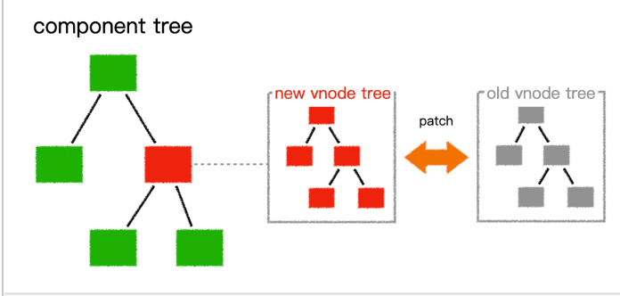
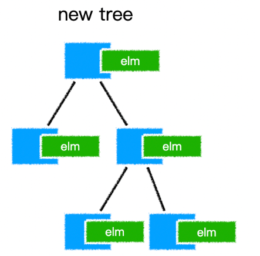
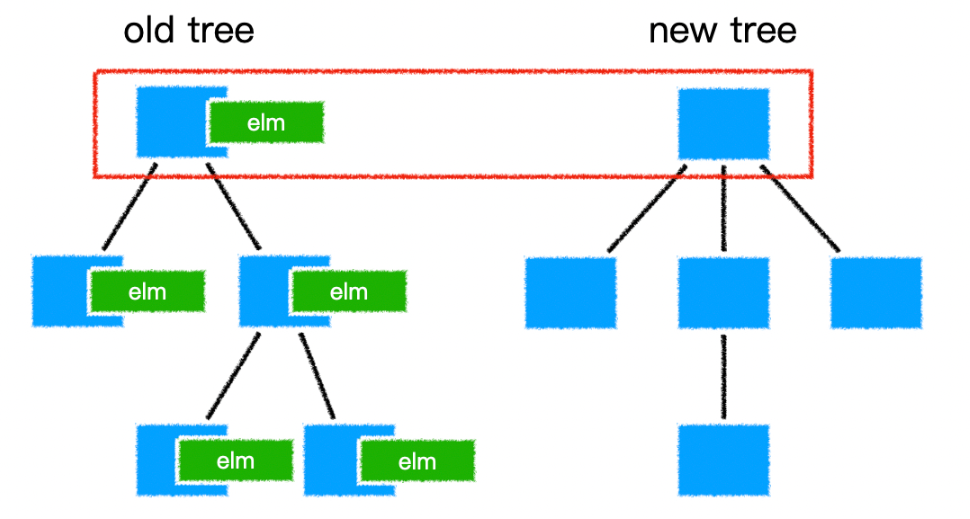

# Vue2 diff 算法原理

## `diff`的时机

当组件创建时，以及依赖的属性或数据变化时，会运行一个函数，该函数会做两件事：

- 运行`_render`生成一棵新的虚拟 dom 树（vnode tree）
- 运行`_update`，传入虚拟 dom 树的根节点，对新旧两棵树进行对比，最终完成对真实 dom 的更新

核心代码如下：

```javascript
// vue构造函数
function Vue() {
  // ... 其他代码
  var updateComponent = () => {
    this._update(this._render());
  };
  new Watcher(updateComponent);
  // ... 其他代码
}
```

`diff`就发生在`_update`函数的运行过程中

## `_update`函数在干什么

`_update`函数接收到一个`vnode`参数，这就是**新**生成的虚拟 dom 树
同时，`_update`函数通过当前组件的`_vnode`属性，拿到**旧**的虚拟 dom 树
`_update`函数首先会给组件的`_vnode`属性重新赋值，让它指向新树

```javascript
function update(vnode) {
  // vnode:新
  // this._vnode:旧
  var oldVnode = this._vnode;
  this._vnode = vnode; //虚拟dom其实在这一步就已经更新了，所以对比的木得是更新真实DOM
}
```



然后会判断旧树是否存在：

### 不存在

说明这是第一次加载组件，于是通过内部的`patch`函数，直接遍历新树，为每个节点生成真实 DOM，挂载到每个节点的`elm`属性上

```javascript
function update(vnode) {
  // vnode: 新
  // this._vnode: 旧
  var oldVnode = this._vnode;
  this._vnode = vnode;
  // 对比的目的：更新真实dom
  if (!oldVnode) {
    this.__patch__(this.$el, vnode); //el：元素位置
  }
}
```



### 存在

说明之前已经渲染过该组件，于是通过内部的`patch`函数，对新旧两棵树进行对比，以达到下面两个目标：

- **完成对所有真实 dom 的最小化处理**
- **让新树的节点对应合适的真实 dom**


## `patch`函数的对比流程

术语解释：

1. 「**相同**」：是指两个虚拟节点的标签类型、`key`值均相同，但`input`元素还要看`type`属性

```javascript
/**
 * 什么叫「相同」是指两个虚拟节点的标签类型、`key`值均相同，但`input`元素还要看`type`属性
 *
 * <h1>asdfdf</h1>        <h1>asdfasfdf</h1>    相同
 *
 * <h1 key="1">adsfasdf</h1>   <h1 key="2">fdgdf</h1> 不同
 *
 * <input type="text" />    <input type="radio" /> 不同
 *
 * abc        bcd  相同
 *
 * {
 *  tag: undefined,
 *  key: undefined,
 *  text: "abc"
 * }
 *
 * {
 *  tag: undefined,
 *  key: undefined,
 *  text: "bcd"
 * }
 */

// 这里的判断相同使用到的是sameVnode函数：源码
function sameVnode(a, b) {
  return (
    a.key === b.key &&
    ((a.tag === b.tag &&
      a.isComment === b.isComment &&
      isDef(a.data) === isDef(b.data) &&
      sameInputType(a, b)) ||
      (isTrue(a.isAsyncPlaceholder) &&
        a.asyncFactory === b.asyncFactory &&
        isUndef(b.asyncFactory.error)))
  );
}
```

2. 「**新建元素**」：是指根据一个虚拟节点提供的信息，创建一个真实 dom 元素，同时挂载到虚拟节点的`elm`属性上
3. 「**销毁元素**」：是指：`vnode.elm.remove()`
4. 「**更新**」：是指对两个虚拟节点进行对比更新，它**仅发生**在两个虚拟节点「相同」的情况下。具体过程稍后描述。
5. 「**对比子节点**」：是指对两个虚拟节点的子节点进行对比，具体过程稍后描述(**深度优先**)

## 详细流程：

### **根节点比较**



`patch`函数首先对根节点进行比较

如果两个节点：

- 「相同」，进入「更新」流程
  1. 将旧节点的真实 dom 赋值到新节点：`newVnode.elm = oldVnode.elm`
  2. **对比新节点和旧节点的属性**，有变化的更新到真实 dom 中
  3. 当前两个节点处理完毕，开始「对比子节点」
- 不「相同」 （**直接看成旧树不存在**）
  1. 新节点**递归**「新建元素」
  2. 旧节点「销毁元素」

### **「对比子节点」**

在「对比子节点」时，vue 一切的出发点，都是为了：

- **尽量啥也别做**
- 不行的话，**尽量仅改动元素属性**
- 还不行的话，尽量移动元素，而不是删除和创建元素
- 还不行的话，删除和创建元素

> 流程

- 对比旧树和新树的头指针，一样就进入更新流程(递归)新旧相连，对比有没有属性变化，对比子节点(递归)

- 两个头指针往后移动，如果不一样，就比较尾指针，尾指针一样，**递归**。

- 两个尾指针往前移动，再次比较头指针，还是不一样，尾指针也不一样，就比较旧树的头和新树的尾，一样的话，连接，复用真实都 dom，更新属性，再把真实 dom 的位置移动到旧树的尾指针后

- 新指针的尾指针往前移动，旧指针的头指针往后移动，**头头不同，尾尾不同，两边的头尾不同，则以新树的头为基准，看一下在旧树里面存不存在，存在则复用，真实 dom 的位置调到前面。**

- 继续，头头不同，尾尾不同，头尾相同，同理交换，交换后把真实 dom 移动到头指针前面。

- 继续，都不相同了，找 8 在旧树里面存不存在，不存在就新建。继续移动，头指针>尾指针，循环结束。

- **销毁**旧树剩下的对应的**真实 dom**。

## 对开发的影响：

### 加 key

> 为什么要 key？如果不加，会把所有子元素直接改动，浪费效率；如果加上，变成了指针，dom 移动(没有改动真实 dom 内部)，对真实 dom 几乎没有改动

```html
<div id="app" style="width: 500px; margin: 0 auto; line-height: 3">
  <div>
    <a href="" @click.prevent="accoutLogin=true">账号登录</a>
    <span>|</span>
    <a href="" @click.prevent="accoutLogin=false">手机号登录</a>
  </div>
  <!-- 根据accoutLogin是否显示，如果没有key，默认key:undefined,新旧树的div没变，进入里面对比，里面也相同，会导致文本框里的内容不消失 -->
  <div v-if="accoutLogin" key="1">
    <label>账号</label>
    <input type="text" />
  </div>
  <div v-else key="2">
    <label>手机号</label>
    <input type="text" />
  </div>
</div>
```

## 总结

当组件创建和更新时，vue 均会执行内部的 update 函数，该函数使用 render 函数生成的虚拟 dom 树，将新旧两树进行对比，找到差异点，最终更新到真实 dom

对比差异的过程叫 diff，vue 在内部通过一个叫 patch 的函数完成该过程

在对比时，vue 采用**深度优先、同层比较**的方式进行比对。

在判断两个节点是否相同时，vue 是通过**虚拟节点的 key 和 tag**来进行判断的

**具体来说**

- 首先对根节点进行对比，如果相同则将旧节点关联的真实 dom 的**引用**挂到新节点上，然后根据需要更新属性到真实 dom
- 然后再对比其子节点数组；如果不相同，则按照新节点的信息递归创建所有真实 dom，同时挂到对应虚拟节点上，然后移除掉旧的 dom。

- 在对比其子节点数组时，vue 对每个子节点数组使用了两个指针，分别指向头尾，然后不断向中间靠拢来进行对比，这样做的目的是**尽量复用真实 dom，尽量少的销毁和创建真实 dom**。如果发现相同，则进入和根节点一样的对比流程，如果发现不同，则移动真实 dom 到合适的位置。

这样一直递归的遍历下去，直到整棵树完成对比。

## **_Vue_ 中的 _Key_ 的作用是什么？**

> **_key_ 的作用主要是为了高效的更新虚拟 _DOM_**。另外 _vue_ 中在使用相同标签名元素的过渡切换时，也会使用到 _key_ 属性，其目的也是为了让 _vue_ 可以区分它们，否则 _vue_ 只会替换其内部属性而不会触发过渡效果。

> 解析：
>
> 其实不只是 _vue_，_react_ 中在执行列表渲染时也会要求给每个组件添加上 _key_ 这个属性。
>
> 要解释 _key_ 的作用，不得不先介绍一下虚拟 _DOM_ 的 _Diff_ 算法了。
>
> 我们知道，_vue_ 和 _react_ 都实现了一套虚拟 _DOM_，使我们可以不直接操作 _DOM_ 元素，只操作数据便可以重新渲染页面。而隐藏在背后的原理便是其高效的 _Diff_ 算法。
>
> _vue_ 和 _react_ 的虚拟 _DOM_ 的 _Diff_ 算法大致相同，其核心有以下两点：
>
> - 两个相同的组件产生类似的 _DOM_ 结构，不同的组件产生不同的 _DOM_ 结构。
> - 同一层级的一组节点，他们可以通过唯一的 _id_ 进行区分。

> 基于以上这两点，使得虚拟 _DOM_ 的 _Diff_ 算法的复杂度从 _O(n^3)_ 降到了 _O(n)_。
> 
> 当页面的数据发生变化时，_Diff_ 算法只会比较同一层级的节点：
>
> - 如果节点类型不同，直接干掉前面的节点，再创建并插入新的节点，不会再比较这个节点以后的子节点了。
> - 如果节点类型相同，则会重新设置该节点的属性，从而实现节点的更新。

> 当某一层有很多相同的节点时，也就是列表节点时，_Diff_ 算法的更新过程默认情况下也是遵循以上原则。
>
> 比如一下这个情况：
>
> 
>
> 我们希望可以在 _B_ 和 _C_ 之间加一个 _F_，_Diff_ 算法默认执行起来是这样的：
>
> 
>
> 即把 _C_ 更新成 _F_，_D_ 更新成 _C_，_E_ 更新成 _D_，最后再插入 _E_
>
> 是不是很没有效率？
>
> 所以我们需要使用 _key_ 来给每个节点做一个唯一标识，_Diff_ 算法就可以正确的识别此节点，找到正确的位置区插入新的节点。
>
> 

## **在给 _vue_ 中的元素设置 _key_ 值时可以使用 _Math_ 的 _random_ 方法么？**

> _random_ 是生成随机数，有一定概率多个 _item_ 会生成相同的值，不能保证唯一。
>
> 如果是根据数据来生成 _item_，数据具有 _id_ 属性，那么就可以使用 _id_ 来作为 _key_。
>
> 如果不是根据数据生成 _item_，那么最好的方式就是使用时间戳来作为 _key_。或者使用诸如 _uuid_ 之类的库来生成唯一的 _id_。

## Vue 中 key 的作用

vue 中 key 值的作用可以分为两种情况来考虑：

- 第一种情况是 v-if 中使用 key。由于 Vue 会尽可能高效地渲染元素，通常会复用已有元素而不是从头开始渲染。因此当使用 v-if 来实现元素切换的时候，如果切换前后含有相同类型的元素，那么这个元素就会被复用。如果是相同的 input 元素，那么切换前后用户的输入不会被清除掉，这样是不符合需求的。因此可以通过使用 key 来唯一的标识一个元素，这个情况下，使用 key 的元素不会被复用。这个时候 key 的作用是用来标识一个独立的元素。
- 第二种情况是 v-for 中使用 key。用 v-for 更新已渲染过的元素列表时，它默认使用“就地复用”的策略。如果数据项的顺序发生了改变，Vue 不会移动 DOM 元素来匹配数据项的顺序，而是简单复用此处的每个元素。因此通过为每个列表项提供一个 key 值，来以便 Vue 跟踪元素的身份，从而高效的实现复用。这个时候 key 的作用是为了高效的更新渲染虚拟 DOM。

key 是为 Vue 中 vnode 的唯一标记，通过这个 key，diff 操作可以更准确、更快速

- 更准确：因为带 key 就不是就地复用了，在 sameNode 函数 a.key === b.key 对比中可以避免就地复用的情况。所以会更加准确。
- 更快速：利用 key 的唯一性生成 map 对象来获取对应节点，比遍历方式更快

## 为什么不建议用 index 作为 key?

使用 index 作为 key 和没写基本上没区别，因为不管数组的顺序怎么颠倒，index 都是 0, 1, 2...这样排列，导致 Vue 会复用错误的旧子节点，做很多额外的工作。
