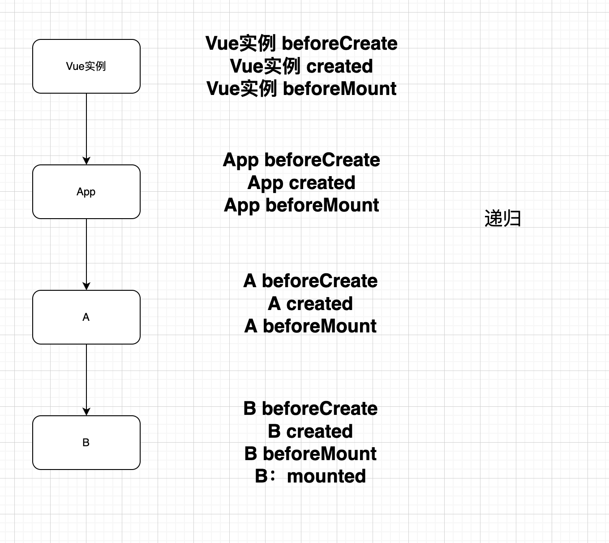
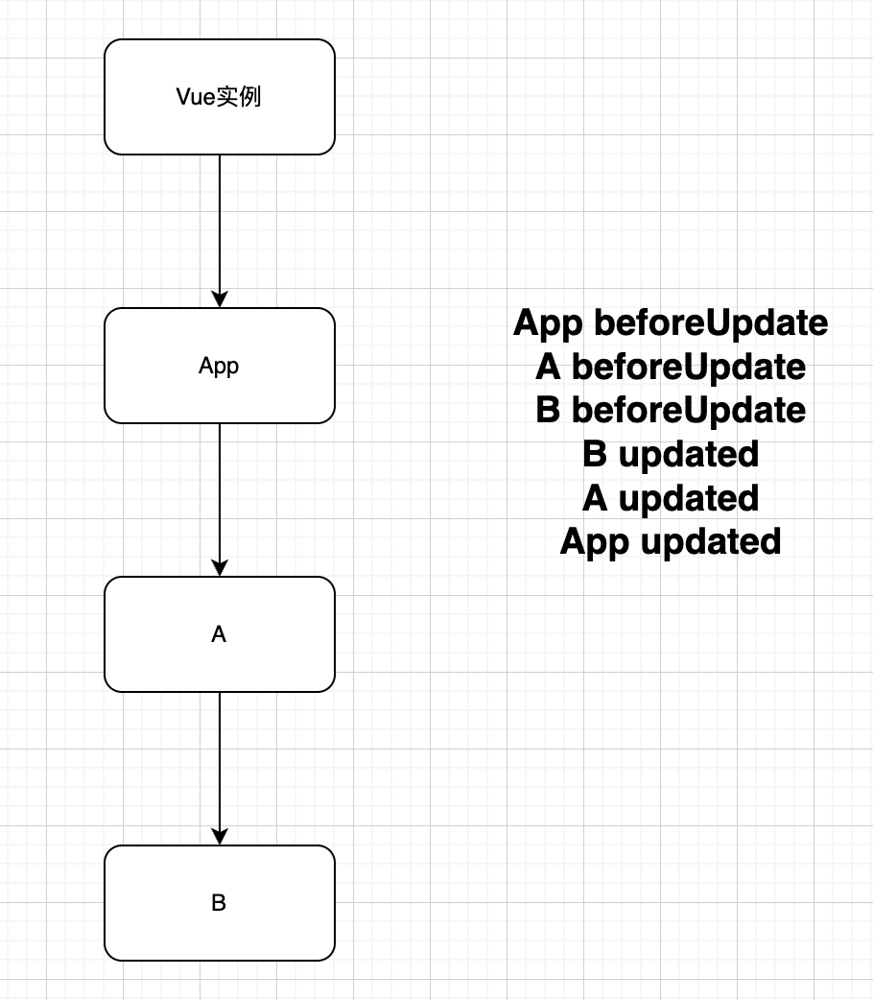
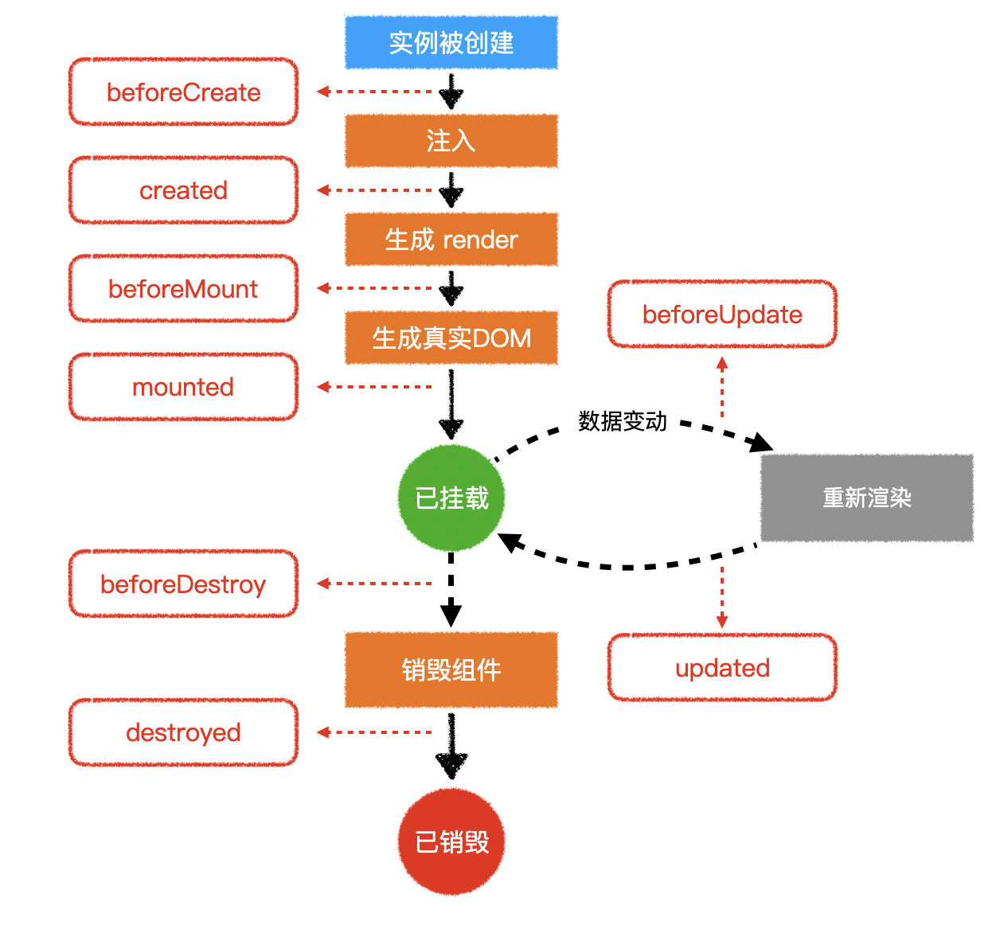

# Vue 生命周期

## 创建 vue 实例和创建组件的流程基本一致

1. 首先做一些初始化的操作，主要是设置一些私有属性到实例中
2. **运行生命周期钩子函数**`beforeCreate`
3. 进入注入流程：处理属性、computed、methods、data、provide、inject，最后使用代理模式将它们挂载到实例中

data 为例：

```javascript
function Vue(options) {
  var data = options.data();
  observe(data); // 变成响应式数据
  var methods = options.methods; //直接赋值
  Object.defineProperty(this, "a", {
    get() {
      return data.a;
    },
    set(val) {
      data.a = val;
    },
  });

  Object.entries(methods).forEach(([methodName, fn]) => {
    this[methodName] = fn.bind(this); //拿到每一个methods
    // bind绑定，使得在vue里，this始终指向vue实例
  });

  var updateComponent = () => {
    this._update(this._render());
  };

  new Watcher(updateComponent);
}

new Vue(vnode.componentOptions);
```

4. **运行生命周期钩子函数**`created`
5. 渲染：生成`render`函数：如果有配置，直接使用配置的`render`，如果没有，使用运行时编译器，把模板编译为`render`
6. **运行生命周期钩子函数**`beforeMount`
7. 创建一个`Watcher`，传入一个函数`updateComponent`，该函数会运行`render`，把得到的`vnode`再传入`_update`函数执行。
   在执行`render`函数的过程中，会收集所有依赖，将来依赖变化时会重新运行`updateComponent`函数
   在执行`_update`函数的过程中，触发`patch`函数，由于目前没有旧树，因此直接为当前的虚拟 dom 树的每一个普通节点生成 elm 属性，即真实 dom。
   如果遇到创建一个组件的 vnode，则会进入组件实例化流程，该流程和创建 vue 实例流程基本相同，递归，最终会把创建好的组件实例挂载 vnode 的`componentInstance`属性中，以便复用。
8. **运行生命周期钩子函数**`mounted`

:::tip Vue 父子组件挂载顺序

:::

## 重渲染？

1. 数据变化后，所有依赖该数据的`Watcher`均会重新运行，这里仅考虑`updateComponent`函数对应的`Watcher`
2. `Watcher`会被调度器放到`nextTick`中运行，也就是微队列中，这样是为了避免多个依赖的数据同时改变后被多次执行
3. 运行生命周期钩子函数`beforeUpdate`
4. `updateComponent`函数重新执行

- 在执行`render`函数的过程中，会去掉之前的依赖，重新收集所有依赖，将来依赖变化时会重新运行`updateComponent`函数
- 在执行`_update`函数的过程中，触发`patch`函数。
- 新旧两棵树进行对比。
- 普通`html`节点的对比会导致真实节点被创建、删除、移动、更新
- 组件节点的对比会导致组件被创建、删除、移动、更新
- 当新组件需要创建时，进入实例化流程
- 当旧组件需要删除时，会调用旧组件的`$destroy`方法删除组件，该方法会先触发生命周期钩子函数`beforeDestroy`，然后递归调用子组件的`$destroy`方法，然后触发生命周期钩子函数- `destroyed`
- 当组件属性更新时，相当于组件的`updateComponent`函数被重新触发执行，进入重渲染流程，和本节相同。

5. **运行生命周期钩子函数**`updated`

:::tip Vue 父子组件重新渲染顺序

:::

## 总体流程



## 解释一下对 _Vue_ 生命周期的理解

### **什么是 _vue_ 生命周期**

对于 _vue_ 来讲，生命周期就是一个 _vue_ 实例从创建到销毁的过程。

### **_vue_ 生命周期的作用是什么**

在生命周期的过程中会运行着一些叫做生命周期的函数，给予了开发者在不同的生命周期阶段添加业务代码的能力。

其实和回调是一个概念，当系统执行到某处时，检查是否有 _hook_(钩子)，有的话就会执行回调。

通俗的说，_hook_ 就是在程序运行中，在某个特定的位置，框架的开发者设计好了一个钩子来告诉我们当前程序已经运行到特定的位置了，会触发一个回调函数，并提供给我们，让我们可以在生命周期的特定阶段进行相关业务代码的编写。

### **_vue_ 生命周期有几个阶段**

它可以总共分为 _8_ 个阶段：创建前/后, 载入前/后,更新前/后,销毁前/销毁后。

- _beforeCreate_：是 _new Vue( )_ 之后触发的第一个钩子，在当前阶段 _data、methods、computed_ 以及 _watch_ 上的数据和方法都不能被访问。

- _created_：在实例创建完成后发生，当前阶段已经完成了数据观测，也就是可以使用数据，更改数据，在这里更改数据不会触发 _updated_ 函数。可以做一些初始数据的获取，在当前阶段无法与 _DOM_ 进行交互，如果非要想，可以通过 _vm.$nextTick_ 来访问 _DOM_ 。

- _beforeMount_：发生在挂载之前，在这之前 _template_ 模板已导入渲染函数编译。而当前阶段虚拟 _DOM_ 已经创建完成，即将开始渲染。在此时也可以对数据进行更改，不会触发 _updated_。

- _mounted_：在挂载完成后发生，在当前阶段，真实的 _DOM_ 挂载完毕，数据完成双向绑定，可以访问到 _DOM_ 节点，使用 _$refs_ 属性对 _DOM_ 进行操作。

- _beforeUpdate_：发生在更新之前，也就是响应式数据发生更新，虚拟 _DOM_ 重新渲染之前被触发，你可以在当前阶段进行更改数据，不会造成重渲染。

- _updated_：发生在更新完成之后，当前阶段组件 _DOM_ 已完成更新。要注意的是避免在此期间更改数据，因为这可能会导致无限循环的更新。

- _beforeDestroy_：发生在实例销毁之前，在当前阶段实例完全可以被使用，我们可以在这时进行善后收尾工作，比如清除计时器。

- _destroyed_：发生在实例销毁之后，这个时候只剩下了 _DOM_ 空壳。组件已被拆解，数据绑定被卸除，监听被移出，子实例也统统被销毁。

- **activated** keep-alive 专属，组件被激活时调用

- **deactivated** keep-alive 专属，组件被销毁时调用

### **第一次页面加载会触发哪几个钩子**

会触发 _4_ 个钩子，分别是：_beforeCreate、created、beforeMount、mounted_

- **_DOM_ 渲染在哪个周期就已经完成**

_DOM_ 渲染是在 _mounted_ 阶段完成，此阶段真实的 _DOM_ 挂载完毕，数据完成双向绑定，可以访问到 _DOM_ 节点。

### **多组件（父子组件）中生命周期的调用顺序说一下**

组件的调用顺序都是先父后子，渲染完成的顺序是先子后父。组件的销毁操作是先父后子，销毁完成的顺序是先子后父。

- 加载渲染过程：父*beforeCreate*->父*created*->父*beforeMount*->子*beforeCreate*->子*created*->子*beforeMount*- >子*mounted*->父*mounted*

- 子组件更新过程：父*beforeUpdate*->子*beforeUpdate*->子*updated*->父*updated*

- 父组件更新过程：父 _beforeUpdate_ -> 父 _updated_

- 销毁过程：父*beforeDestroy*->子*beforeDestroy*->子*destroyed*->父 destroyed
